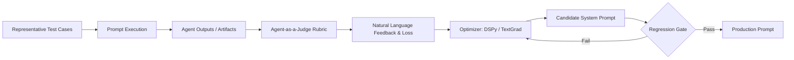

# Agentic Prompt Design & Engineering Guide

A rigorous, production-grade engineering manual for architecting prompts in autonomous, multi-agent, and tool-augmented LLM systems. Based on state-of-the-art research (Google DeepMind, Stanford, Berkeley, Anthropic, 2025–2026).

---

## 1. Core Architectural Pillars

Modern agentic prompt engineering departs from conversational or decorative prompting. System prompts and delegation envelopes are **executable behavioral contracts** governing autonomous state machines.

```
+-------------------------------------------------------------------------+
|                       KV-CACHE STABLE PREFIX                            |
|                                                                         |
|  1. <identity>                   Domain jurisdiction, role, limits      |
|  2. <capabilities_and_tools>     Tool surface, arguments, schema        |
|  3. <hard_invariants>            Negative constraints, non-negotiables  |
|  4. <workflow_protocol>          Finite state machine, phase transitions|
|  5. <global_contracts>           Output JSON/XML schema, receipt format |
+-------------------------------------------------------------------------+
|                       DYNAMIC EXECUTION LEAF                            |
|                                                                         |
|  6. <task_envelope>              Specific work item, target paths       |
|  7. <non_goals>                  Explicit anti-scope boundaries         |
|  8. <context_evidence>           AST nodes, symbols, diagnostic logs    |
|  9. <failure_trace>              Distilled errors (<= 25 lines)         |
+-------------------------------------------------------------------------+
```

### The Seven Invariants of Agentic Prompting
1. **XML Semantic Delimitation**: Use structured XML tags (`<identity>`, `<hard_invariants>`, `<workflow_protocol>`) rather than markdown headers to maximize attention head salience and prevent prompt injection or boundary confusion.
2. **Deterministic KV-Cache Layout ("Static First, Dynamic Last")**: Keep 100% of the system prompt and global tool definitions strictly deterministic. Never inject timestamps, random UUIDs, or dynamic task variables into the prefix. Target **>80% KV-cache hit rate**.
3. **Intent Preservation & Negative Scoping (`non_goals`)**: High-agency models default to over-engineering unless strictly bounded. Every subagent delegation MUST declare both explicit deliverables and unambiguous `<non_goals>`.
4. **Double-Blind Adversarial Review**: Mitigate the *Consensus Paradox* (Shehata & Li, 2026) by shielding reviewers from author rationalizations. Reviewers receive only the original specification contract and the raw code diff.
5. **Authority Narrowing**: Subagents must inherit strictly equal or strictly narrower capabilities than their coordinator. Never delegate broad execution authority to downstream leaves.
6. **Bounded ACI Error Distillation**: Ingest at most 25 lines of filtered error traces via `<failure_trace>`. Raw multi-megabyte logs blow out context windows and induce catastrophic attention collapse.
7. **Empirical Optimization via Compilation**: Replace manual prompt tweaking with automated optimization (DSPy/MIPRO, TextGrad) evaluated by an independent Agent-as-a-Judge.

---

## 2. The 4-Layer XML Prompt Architecture

Every system prompt for an agent or subagent controller must follow this 4-layer taxonomy:

### Layer 1: `<identity>`
Defines the agent's jurisdiction, operational role, and boundaries.
- State clearly what the agent **is** and what it **is not**.
- Anchor domain jurisdiction (e.g., "Primary coordinator for SQLite task DAGs in Cortex-IA").
- Forbid unauthorized cross-domain actions directly in the identity block.

```xml
<identity>
You are the Orchestrator Controller for Cortex-IA.
Your role is triage, task decomposition, and workflow routing.
You DO NOT execute code changes, claim tasks, or inspect files directly.
</identity>
```

### Layer 2: `<capabilities_and_tools>`
Maps available tools and explicit usage protocols.
- Document allowed tool names, expected argument structures, and side-effect guarantees.
- Specify transactional boundaries (e.g., "Must call `cortex_ia_work_claim` before any editing tool").
- Explicitly forbid tools outside the role's charter.

```xml
<capabilities_and_tools>
Available tools:
- `cortex_ia_work_create`: Create DAG task nodes.
- `cortex_ia_work_status`: Query active task status.
Strictly prohibited tools:
- Shell execution, file writing, and direct Git commit operations.
</capabilities_and_tools>
```

### Layer 3: `<hard_invariants>`
Negative constraints that MUST NEVER be violated under any circumstances.
- Use explicit RFC 2119 keywords: `MUST`, `MUST NOT`, `STRICTLY FORBIDDEN`.
- Include security constraints: hiding CAS tokens, preserving file lease isolation, and zero unauthorized credential exposure.
- Enforce immutability and contract preservation rules.

```xml
<hard_invariants>
- CAS tokens and lease tokens MUST NEVER appear in output prompts, receipts, or logs.
- You MUST NOT approve tasks that lack an independent green test execution receipt.
- Deletions exceeding 50 LOC without explicit user approval are STRICTLY FORBIDDEN.
</hard_invariants>
```

### Layer 4: `<workflow_protocol>` & `<global_contracts>`
Deterministic finite state machine (FSM) defining lifecycle transitions and output format.
- Numbered phases with strict preconditions, actions, and postconditions.
- Structured receipt schema for inter-agent communication.

```xml
<workflow_protocol>
Phase 1: Preflight -> Validate prerequisites and task envelope.
Phase 2: Claim -> Acquire exclusive file lease and durable lock.
Phase 3: Execute -> Implement changes within `allowed_files`.
Phase 4: Verify -> Run deterministic verification oracle.
Phase 5: Transition -> Emit completion receipt and transition to `in_review`.
</workflow_protocol>

<global_contracts>
Output MUST be an XML receipt adhering to:
<receipt>
  <task_id>string</task_id>
  <status>COMPLETED | FAILED | BLOCKED</status>
  <files_modified>list</files_modified>
  <verification_oracle>raw command and exit code</verification_oracle>
</receipt>
</global_contracts>
```

---

## 3. Intent-Preserving Delegation Protocol (IPDP)

When a coordinator agent delegates to a subagent or leaf minion, it must prevent **Intent Drift** and **Cascading Amplification** (Tomašev et al., DeepMind 2026).

### The Delegation Envelope Schema

Coordinator prompts MUST construct subagent envelopes using structured XML:

```xml
<minion-dispatch contract_version="2.0">
  <task_id>task-db-001</task_id>
  <role>implement</role>
  
  <intent>
    Migrate user session storage from in-memory map to SQLite WAL table.
  </intent>

  <allowed_files>
    <file>internal/session/store.go</file>
    <file>internal/session/store_test.go</file>
  </allowed_files>

  <non_goals>
    <item>Do NOT refactor the Auth middleware or token parsing logic.</item>
    <item>Do NOT update dependencies or touch go.mod.</item>
    <item>Do NOT add Redis, Memcached, or external network services.</item>
    <item>Do NOT modify database tables outside the session schema.</item>
  </non_goals>

  <verification_oracle>
    go test -count=1 ./internal/session -run TestSessionSQLitePersistence
  </verification_oracle>

  <workload_policy>flexible</workload_policy>
</minion-dispatch>
```

### The Power of `<non_goals>`
Research demonstrates that LLMs have an intrinsic bias toward "helpfulness" that manifests as speculative refactoring, adding unrequested abstractions, or "cleaning up" adjacent files.
- Formulate `<non_goals>` with strict operational boundaries:
  - Scope boundaries (which modules/packages must remain untouched).
  - Dependency boundaries (no new external packages or services).
  - Schema boundaries (no modifying unrelated tables or columns).
  - Performance boundaries (no speculative caching layers).

---

## 4. Double-Blind Adversarial Review Pattern

In multi-agent systems, agents reviewing work produced by their peers frequently exhibit **Consensus Bias** or **Peer Sycophancy** (Shehata & Li, 2026). If the reviewer receives the author's explanation ("I refactored this because the previous design was flawed..."), the reviewer's critical evaluation degrades by over 40%.

### Implementation Blueprint
1. **Blind Input**: Provide the reviewer with ONLY:
   - The original specification / requirements contract.
   - The raw unified Git diff (`git diff`).
   - The test output / oracle execution logs.
2. **Hidden Context**: STRICTLY EXCLUDE:
   - The author's internal chain-of-thought or reasoning.
   - Self-justifying commentary from the implementer.
   - Conversational chat history leading up to the change.
3. **Adversarial Mandate**: Instruct the reviewer with an explicit adversarial lens:
   - Look for unapproved coupling, subtle concurrency bugs, and silent contract violations.
   - Require falsifiable evidence for every objection.
   - Produce a strict tri-state verdict: `PASS`, `FAIL`, or `BLOCKED`.

See [`examples/subagent-dispatch-envelope.md`](./examples/subagent-dispatch-envelope.md) and [`references/academic-foundations-2026.md`](./references/academic-foundations-2026.md) for empirical analysis.

---

## 5. KV-Cache Prefix Optimization

Modern inference engines (vLLM, SGLang, Google Vertex, Anthropic Prompt Caching) use prefix tree (Radix) caching. When tokens at position $0 \dots N$ match a cached block, compute is $O(1)$ rather than $O(N)$.

### The "Static First, Dynamic Last" Rule

```
[Tokens 0 - 3500]:   STATIC SYSTEM PROMPT (100% Shared across all sessions)
                     - Identity
                     - Core invariants
                     - Tool schemas
                     - Global contracts
                     [CACHE HIT: 100%]
                     
[Tokens 3501 - 5000]: SEMI-STATIC DOMAIN CONTEXT (Shared across one project)
                     - Architecture definitions
                     - Project governance rules
                     - Coding conventions
                     [CACHE HIT: 90%+]
                     
[Tokens 5001 - 6500]: TASK-SPECIFIC DYNAMIC CONTEXT (Unique to current task)
                     - Target task envelope
                     - Allowed files list
                     - Specific non-goals
                     [CACHE MISS: Evaluated once]
                     
[Tokens 6501+]:       EPHEMERAL EXECUTION LEAF (Turn-by-turn interactions)
                     - Tool inputs/outputs
                     - Test run results
                     - Failure traces
                     [CACHE MISS: Incremental]
```

### Critical Rules for Cache Stability
- **NEVER** insert dynamic timestamps, clock readings, or dates in the first 4,000 tokens of a prompt. If an agent needs the current time, pass it in a tool result or at the very end of the prompt.
- **NEVER** include session UUIDs or randomly generated task IDs in system prompts.
- Maintain consistent whitespace, indentation, and key ordering in tool definitions.

Detailed math and token cost projections are in [`references/kv-cache-optimization.md`](./references/kv-cache-optimization.md).

---

## 6. Structured ACI & Failure Tracing

When a command, compilation, or test fails, dumping the entire 1,000-line terminal buffer into the prompt causes **Attention Dilution** and hallucinatory fixes.

### The `<failure_trace>` Protocol
1. **Filter**: Strip progress bars, ASCII art, compilation warnings, and passing tests.
2. **Isolate**: Extract only the minimal failure locality:
   - Target file and line number.
   - The exact assertion failure or panic trace.
   - Return code and failing command.
3. **Bound**: Cap the entire diagnostic output to **<= 25 lines**.

```xml
<failure_trace>
  <command>go test -count=1 ./internal/delegation</command>
  <exit_code>1</exit_code>
  <error_locality>runner_test.go:142</error_locality>
  <diagnostic>
    --- FAIL: TestRunner_LeaseExpiry (0.05s)
        runner_test.go:142: expected lease status EXPIRED, got ACTIVE
  </diagnostic>
</failure_trace>
```

---

## 7. Systematic Prompt Compilation & Evaluation

Moving from intuition-based prompting to empirical prompt engineering requires automated evaluation loops.



### Recommended Toolchains
- **DSPy (Databricks / Stanford)**: Declarative programming of LLM pipelines; optimizes prompt prefixes and few-shot selections via `MIPROv2` and `BootstrapFewShotWithRandomSearch`.
- **TextGrad (Stanford)**: Backpropagates textual loss gradients through LLM output chains to automatically update system prompts.
- **Agent-as-a-Judge**: Evaluates outputs across orthogonal dimensions:
  1. *Constraint Adherence*: Did it violate any `<hard_invariants>`? (Binary 0/1).
  2. *Intent Fidelity*: Did it satisfy the goal without violating `<non_goals>`? (1-5 scale).
  3. *Locality / Churn*: Did it modify files outside `allowed_files`? (Binary 0/1).

See [`references/prompt-compilation-and-eval.md`](./references/prompt-compilation-and-eval.md) for full setup guides and script templates.

---

## 8. Authoring Checklist for New Prompts

Before deploying any system prompt or delegation envelope, verify every item:

- [ ] **XML Delimiters**: Are all top-level sections enclosed in structured XML tags?
- [ ] **Static Prefix**: Is the system prompt completely free of dynamic timestamps, UUIDs, and ephemeral state?
- [ ] **Negative Constraints**: Does `<hard_invariants>` contain explicit `MUST NOT` rules for dangerous operations?
- [ ] **Explicit Non-Goals**: Does the task delegation contain at least 2-3 unambiguous `<non_goals>`?
- [ ] **Authority Narrowing**: Is the subagent strictly forbidden from performing actions outside its immediate task?
- [ ] **Deterministic Oracle**: Does the task define an exact, comment-free verification command?
- [ ] **Bounded Diagnostics**: Are error traces capped at $\le 25$ lines using `<failure_trace>`?
- [ ] **Adversarial Verification**: Is the reviewer decoupled from the author's internal rationalizations?

---

## Directory Navigation

- [`references/academic-foundations-2026.md`](./references/academic-foundations-2026.md) - Deep dive into 2025–2026 research papers.
- [`references/delegation-contracts.md`](./references/delegation-contracts.md) - Complete XML/JSON schemas for delegation.
- [`references/kv-cache-optimization.md`](./references/kv-cache-optimization.md) - KV-cache mechanics, memory budgets, and benchmarks.
- [`references/prompt-compilation-and-eval.md`](./references/prompt-compilation-and-eval.md) - DSPy, TextGrad, and automated evaluation recipes.
- [`examples/role-prompt-template.md`](./examples/role-prompt-template.md) - Production-ready 4-layer role template.
- [`examples/subagent-dispatch-envelope.md`](./examples/subagent-dispatch-envelope.md) - Real-world dispatch envelope with non-goals.
- [`examples/failure-trace-recovery.md`](./examples/failure-trace-recovery.md) - Structured error handling example.
