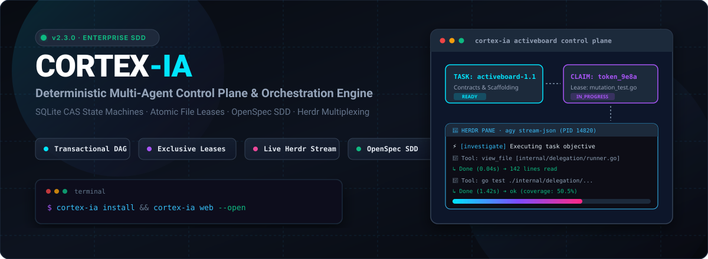
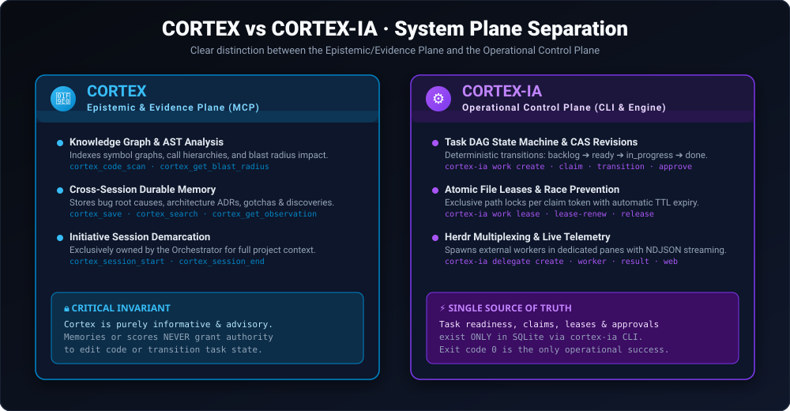
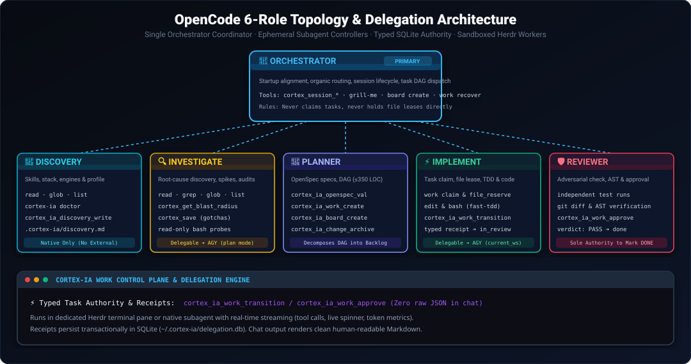

<p align="center">
  
</p>

<p align="center">
  <a href="https://github.com/lleontor705/cortex-ia/releases/latest"></a>
  <a href="https://github.com/lleontor705/cortex-ia/blob/main/LICENSE"></a>
  <a href="https://goreportcard.com/report/github.com/lleontor705/cortex-ia"></a>
  <a href="https://github.com/lleontor705/cortex-ia/actions"></a>
  <a href="https://github.com/lleontor705/cortex-ia"></a>
</p>

---

## ⚡ What is Cortex-IA?

**Cortex-IA** is the enterprise-grade, deterministic **Multi-Agent Control Plane & Orchestration Engine** designed for autonomous software development with **OpenCode** and **Herdr**. 

Built as a single portable Go binary, Cortex-IA solves the fundamental challenges of multi-agent coding: **race conditions**, **conflicting file edits**, **hallucinated task readiness**, **unmonitored background tasks**, and **unstructured coordination**.

```text
┌─────────────────────────────────────────────────────────────────────────────────────────────┐
│                                   CORTEX-IA ECOSYSTEM                                       │
│                                                                                             │
│  ┌───────────────────────┐   ┌─────────────────────────────┐   ┌─────────────────────────┐  │
│  │   OpenCode Agents     │   │   CORTEX-IA Control Plane   │   │  Herdr Multiplexing     │  │
│  │  (Orchestrator, TDD,  │──▶│  (SQLite ACID DAG, Leases,  │──▶│  (Live Stream Terminals,│  │
│  │   Reviewer, Planner)  │   │   CAS Revisions, OpenSpec)  │   │   NDJSON Telemetry)     │  │
│  └───────────────────────┘   └─────────────────────────────┘   └─────────────────────────┘  │
│                                            │                                                │
│                                            ▼                                                │
│                              ┌───────────────────────────┐                                  │
│                              │     CORTEX Server (MCP)   │                                  │
│                              │  (AST Graph & Blast Tree) │                                  │
│                              └───────────────────────────┘                                  │
└─────────────────────────────────────────────────────────────────────────────────────────────┘
```

---

## 🌟 Key Superpowers

- 🔒 **Zero-Race Concurrency with Exclusive File Leases (`work lease`)**  
  Prevents agents from overwriting each other's code. Agents must atomically reserve exclusive workspace-relative file paths with TTL leases before editing.
- 🎯 **Deterministic Task DAG with Optimistic CAS Locking (`work claim` / `transition`)**  
  Tasks transition through strict state machines (`backlog ➔ ready ➔ in_progress ➔ in_review ➔ done`). Dependent tasks automatically unlock only when prior dependencies pass review.
- 🛡️ **Mandatory Independent Review Gates (`work approve`)**  
  Implementers cannot self-approve. An independent reviewer agent must verify test suites and recorded evidence before marking any task complete.
- 📺 **Live Real-time Terminal Telemetry in Herdr Panes (`delegate worker`)**  
  Watch external worker agents think and act in real-time. Features live action humanization, sub-second tool execution telemetry, animated activity spinners, and streamed textual reasoning.
- 📐 **Native OpenSpec SDD Integration (`cortex-ia openspec`)**  
  Built-in support for Specification-Driven Development proposals, RFC 2119 delta specifications, and task decompositions.
- 📊 **Real-time Web Operations Dashboard (`cortex-ia web`)**  
  Embedded, single-binary Web UI with real-time SSE streaming for live board state visualization, task creation, and audit logging.

---

## 🧭 CORTEX (MCP) vs CORTEX-IA (CLI)

<p align="center">
  
</p>

| Dimension | 🧠 **CORTEX** (MCP Server) | ⚙️ **CORTEX-IA** (Control Plane & CLI) |
|---|---|---|
| **Nature** | Standardized MCP Server (32 tools: `cortex_*`) | Standalone native Go binary (`cortex-ia.exe`) |
| **System Plane** | **Epistemic & Evidence Plane** | **Operational Control Plane** |
| **Storage** | Knowledge Graph & AST Symbol DB | ACID Transactional SQLite (`~/.cortex-ia/delegation.db`) |
| **Primary Focus** | • AST code symbols & call graphs<br>• Blast radius impact analysis<br>• Durable bug gotchas & ADR memories<br>• Cross-session project context | • Task DAG & CAS revision state machines<br>• Atomic claim tokens & exclusive file leases<br>• Herdr terminal multiplexing & live NDJSON streaming<br>• OpenSpec SDD validator & Web dashboard |
| **Authority Rule** | **Informative & Advisory Only.** Stored observations never authorize code writes or mark tasks complete. | **Single Source of Truth.** Task readiness, leases, transitions, and approvals exist strictly in SQLite via `cortex-ia work`. |

---

## 🚀 Quick Start

### 1. Interactive Setup (TUI)
Launch the beautiful BubbleTea terminal interface to configure your OpenCode environment:
```bash
cortex-ia
```

### 2. Fast Non-Interactive Installation
```bash
cortex-ia install         # Installs agents, skills, plugins & registers Cortex MCP
cortex-ia sync            # Converges installed home with embedded assets
cortex-ia doctor          # Verifies health, environment paths & tool dependencies
```

### 3. Launch the Real-Time Web Dashboard
```bash
cortex-ia web --open      # Launches the local dashboard at http://127.0.0.1:7331
```

---

## 📦 Installation

### Precompiled Binary (Recommended)
Download the latest prebuilt binary from the [Releases](https://github.com/lleontor705/cortex-ia/releases) page for Windows, macOS, or Linux.

### Go Install
```bash
go install github.com/lleontor705/cortex-ia/cmd/cortex-ia@latest
```

### Install Script (Linux / macOS)
```bash
curl -sSL https://raw.githubusercontent.com/lleontor705/cortex-ia/main/scripts/install.sh | bash
```

### Build from Source
```bash
git clone https://github.com/lleontor705/cortex-ia.git
cd cortex-ia
go build -o bin/cortex-ia ./cmd/cortex-ia
```

---

## 💻 CLI Command Surface

All commands output structured JSON, support both positional arguments and named flags, provide fast aliases (`show`, `get`), and include universal `--help`.

### 1. Task Boards (`cortex-ia board`)
| Command | Syntax | Purpose |
|---|---|---|
| **Create** | `cortex-ia board create <id> "<title>" "[desc]"` | Initialize a durable task-board boundary |
| **List** | `cortex-ia board list` | List all boards with completed/total counters |
| **Status** | `cortex-ia board status <id>` *(or `show`, `get`)* | Query board metadata and full task DAG snapshot |
| **Archive** | `cortex-ia board archive <id>` | Mark a completed board as archived |
| **Unarchive** | `cortex-ia board unarchive <id>` | Restore an archived board to active |
| **Delete** | `cortex-ia board delete <id>` | Permanently delete an archived board and its tasks |
| **Serve** | `cortex-ia board serve [--addr 127.0.0.1:7331]` | Run the embedded loopback web dashboard |

### 2. Work Items & Leases (`cortex-ia work`)
| Command | Syntax | Purpose |
|---|---|---|
| **Create** | `cortex-ia work create <id> "<title>" --board <board> [--depends <id>]...` | Add task to DAG. Auto-sets `backlog` or `ready` |
| **Status** | `cortex-ia work status <id>` *(or `show`, `get`)* | Query task status, revision, claim, and active leases |
| **Claim** | `cortex-ia work claim <id> --owner <agent-id> [--ttl 15m]` | Atomically acquire task; returns `claim_token` |
| **Renew** | `cortex-ia work renew <id> --claim-token <tok> [--ttl 15m]` | Extend live claim TTL before expiry |
| **Lease** | `cortex-ia work lease <id> --claim-token <tok> --path <file> [--ttl 15m]` | Reserve exclusive file lock; returns `lease_token` |
| **Lease Renew** | `cortex-ia work lease-renew --path <file> --lease-token <tok>` | Extend file lease TTL while editing |
| **Release** | `cortex-ia work release --path <file> --lease-token <tok>` | Release file lock on task completion |
| **Transition** | `cortex-ia work transition <id> --claim-token <tok> --to in_review` | Shift state to `in_review`, `in_progress`, or `blocked` |
| **Approve** | `cortex-ia work approve <id> --reviewer <id> --verdict PASS --evidence "<ref>"` | Record review verdict. `PASS` unlocks next tasks |
| **Retry** | `cortex-ia work retry <id>` | Clear residual locks and return `blocked` task to `ready` |
| **Recover** | `cortex-ia work recover` | Sweep expired claims/leases across the workspace |

### 3. OpenSpec SDD Workspace (`cortex-ia openspec` / `openspec`)
| Command | Syntax | Purpose |
|---|---|---|
| **Validate** | `openspec validate [dir]` | Validate `proposal.md`, `specs/`, `design.md`, `tasks.md` |
| **List** | `openspec list` | List active change proposals in the repository |
| **Status** | `openspec status [dir]` | Inspect completion status of OpenSpec delta specifications |

### 4. Worker Delegation (`cortex-ia delegate`)
| Command | Syntax | Purpose |
|---|---|---|
| **Create** | `cortex-ia delegate create --request-file <req.json> [--transport direct\|herdr]` | Register background worker job |
| **Status** | `cortex-ia delegate status <job-id>` | Check job execution lifecycle |
| **Result** | `cortex-ia delegate result <job-id>` | Retrieve structured output receipt & token metrics |
| **Recover** | `cortex-ia delegate recover` | Reconcile lost or expired delegation jobs |

---

## 🤖 Multi-Agent Coordination Topology

<p align="center">
  
</p>

1. **`orchestrator` (Primary)**: Triage, startup alignment, session lifecycle, and task DAG dispatch. Never claims tasks or holds file leases.
2. **`investigate` (Subagent)**: Root-cause diagnosis, AST blast radius inspection, and read-only audits.
3. **`planner` (Subagent)**: Writes OpenSpec delta specifications and decomposes tasks (≤350 LOC).
4. **`implement` (Subagent)**: Atomically claims one task, reserves exclusive file leases, runs TDD oracles, and transitions to review.
5. **`reviewer` (Subagent)**: Independently verifies git diffs, executes test oracles, and grants `PASS` approval to unlock downstream dependencies.

---

## 📺 Live Real-Time Worker Streaming

When tasks are delegated to external workers, Cortex-IA streams human-readable action summaries and live model reasoning directly into the Herdr terminal pane:

```text
======================================================================
🚀 [CORTEX-IA] DELEGATED INVESTIGATE WORKER
----------------------------------------------------------------------
🆔 Role:       investigate
⚙️  CLI:        agy
📂 Directory:  D:\lleontor705\iatask
📋 Objective:  Inspect database migrations and verify WAL mode
----------------------------------------------------------------------
⚡ Initializing worker session...
⠋ [investigate] Worker processing task via agy... (2s elapsed)
⏱️  [Checkpoint: 1.5s]
⚡ [investigate] Read: store.go (view_file)
   ↳ Done (0.04s) ➔ 512 lines read
⚡ [investigate] Grep: modernc.org/sqlite (grep_search)
   ↳ Done (0.08s) ➔ 4 matches found
⚡ [investigate] Exec: go test ./internal/delegation/... (run_command)
   ↳ Done (1.64s) ➔ ok (coverage: 50.5%)

### Investigation Summary
- Database WAL journal mode is strictly enforced.
- Single-connection mutex prevents database locking under high concurrency.

----------------------------------------------------------------------
✅ [CORTEX-IA] Delegated investigate task completed in 8.4s (exit code 0)
📊 Token Usage:   29,747 (in: 28,565, out: 1,182, think: 343)
======================================================================
```

---

## 🛡️ Transactional Safety Guarantees

- **Dry-Run Determinism**: `--dry-run` calculates the exact execution plan without making any disk writes.
- **Cross-Process File Locking**: Every mutating command holds a robust cross-process file lock (`LockFileEx` on Windows, `flock` on Unix) preventing concurrent installer races.
- **Verified Backups & Rollbacks**: Snapshots affected configuration files under `~/.cortex-ia/backups/` and automatically rolls back if an apply phase encounters an error.
- **Strict Path Sandboxing**: Leases and workspace operations reject directory traversal (`..`) and absolute path escape attempts.

---

## 📚 Documentation Reference

- 📖 [Quickstart Guide](docs/quickstart.md) — Guided first-time setup and onboarding
- 🏛️ [Architecture Deep-Dive](docs/architecture.md) — Internal engine layers, models, and SQLite concurrency
- 🤖 [Agent Roles & Contracts](docs/agents.md) — 5-role coordination topology and typed receipt schemas
- 🧠 [Cortex Memory & Graph](docs/cortex-memory.md) — AST symbol graph, blast radius, and durable observations
- 📑 [SDD Workflow Guide](docs/sdd-workflow.md) — Specification-Driven Development lifecycle with OpenSpec
- 🔒 [MCP & Security Boundaries](docs/codebase/mcp-boundaries.md) — Separation of authority and security rules

---

## 📄 License

MIT License · Built with ❤️ by [Luis Leon](https://github.com/lleontor705) and contributors.
