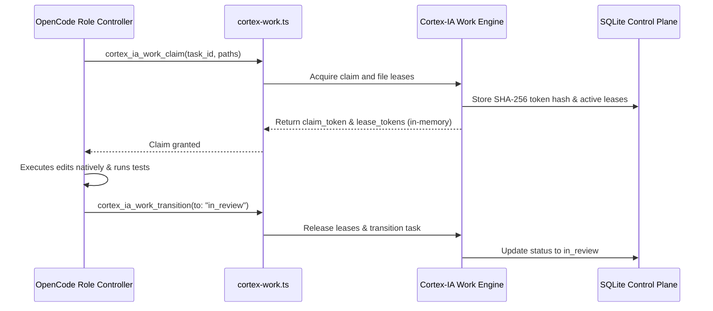

[English](architecture.md) | **Español**

# Análisis profundo de la arquitectura

**Cortex-IA** es el plano de control multiagente determinista, el instalador transaccional y el puente de proceso local para el ecosistema **OpenCode**.

```text
┌─────────────────────────────────────────────────────────────────────────────────────────────┐
│                                   CORTEX-IA LAYERED ARCHITECTURE                            │
│                                                                                             │
│  ┌───────────────────────────────────────────────────────────────────────────────────────┐  │
│  │ 1. PRESENTATION PLANE                                                                 │  │
│  │    • Interactive TUI (BubbleTea wizard)        • Embedded Web Console (SSE / REST)   │  │
│  │    • Optional Herdr Diagnostics (Web)          • Universal CLI Dispatcher            │  │
│  └───────────────────────────────────────────────────────────────────────────────────────┘  │
│                                            │                                                │
│                                            ▼                                                │
│  ┌───────────────────────────────────────────────────────────────────────────────────────┐  │
│  │ 2. CONTROL & COORDINATION PLANE (internal/delegation)                                 │  │
│  │    • SQLite STRICT + WAL ACID Store            • Monotonic CAS Revision Locks         │  │
│  │    • Task DAG (backlog ➔ ready ➔ in_progress)  • Ephemeral Claim Tokens (SHA-256)     │  │
│  │    • Exclusive Workspace File Leases           • Independent Review Gates (Approve)   │  │
│  └───────────────────────────────────────────────────────────────────────────────────────┘  │
│                                            │                                                │
│                                            ▼                                                │
│  ┌───────────────────────────────────────────────────────────────────────────────────────┐  │
│  │ 3. SPECIFICATION PLANE (OpenSpec)                                                     │  │
│  │    • RFC 2119 Delta Requirements               • Change Proposals & Design Docs       │  │
│  │    • Tasks Specification (DAG Decompositions)  • Schema & Contract Validator          │  │
│  └───────────────────────────────────────────────────────────────────────────────────────┘  │
│                                            │                                                │
│                                            ▼                                                │
│  ┌───────────────────────────────────────────────────────────────────────────────────────┐  │
│  │ 4. EPISTEMIC & EVIDENCE PLANE (Cortex MCP)                                            │  │
│  │    • AST Code Symbol Graph & Relationships     • Blast Radius Impact Tree Engine      │  │
│  │    • Durable Bug & ADR Observations            • Session Lifecycle Demarcation        │  │
│  └───────────────────────────────────────────────────────────────────────────────────────┘  │
└─────────────────────────────────────────────────────────────────────────────────────────────┘
```

---

## 1. Estructura de paquetes y responsabilidades

```text
cmd/cortex-ia/               Entry point main(): release versioning + app bootstrap
internal/
├── app/                     CLI command routers (board, work, openspec, mcp, web)
├── delegation/              ACID SQLite engine: DAG, claims, leases, reviews, approvals
├── cortexiaweb/             Embedded HTTP web server with SSE live event stream
├── herdr/                   Optional Herdr setup/detection helpers (diagnostics only)
├── agents/opencode/         OpenCode configuration layout & safe asset path mapping
├── components/filemerge/    Safe JSONC three-way merger with comment preservation
├── mcpmanager/              Managed MCP server catalog (cortex, context7)
├── pipeline/                Transactional engine: Plan, Backup, Apply, Rollback
├── backup/                  Snapshot capture, manifest verification & restore
├── state/                   Home metadata, installation accreditation & cross-process locks
├── tui/                     Terminal User Interface (BubbleTea)
└── assets/                  Embedded runtime assets (AGENTS.md, agents, commands, skills, plugins)
web/                         Preact SPA source (compiled into internal/cortexiaweb/static)
```

---

## 2. Motor de concurrencia y bloqueo optimista (`internal/delegation`)

Cortex-IA usa SQLite sin CGO (`modernc.org/sqlite`) configurado en modo de journal `WAL` con `busy_timeout=5000` y un mutex de conexión única (`SetMaxOpenConns(1)`):

### A. Revisiones CAS monótonas
Cada elemento de trabajo mantiene un `revision` entero. Las transiciones de estado (`claim`, `transition`, `approve`, `retry`) usan transacciones atómicas `BEGIN IMMEDIATE` con comprobaciones Compare-And-Swap (CAS):
```sql
UPDATE work_items 
SET status = ?, revision = revision + 1, updated_at = ? 
WHERE id = ? AND revision = ?;
```
Si un proceso concurrente modificó la tarea mientras tanto, la operación falla con un conflicto tipado `ErrStaleRevision` en lugar de crear una condición de carrera silenciosa.

### B. Hashes criptográficos de tokens
- **Claims**: cuando un agente reclama una tarea (`work claim`), se genera un token aleatorio seguro de 256 bits y se devuelve a quien lo solicita. Solo el digest SHA-256 (`tokenHash`) se almacena en SQLite.
- **File Leases**: al reservar archivos en exclusiva (`work lease`), se genera un `lease_token` distinto.
- **Verificación**: para renovar o transicionar una tarea, el agente debe presentar el token en memoria sin procesar. Los tokens nunca se persisten en disco, en git ni en Cortex MCP.

### C. Desbloqueo automático de dependencias
Cuando un revisor registra una aprobación `PASS` mediante `work approve`:
1. El estado de la tarea cambia atómicamente de `in_review` a `done`.
2. Se purgan todos los file leases activos.
3. El motor invoca `unlockDependents`, que busca todas las tareas descendientes en `backlog` cuyas dependencias ahora están satisfechas al 100% y las transiciona a `ready`.

---

## 3. Modelo de ejecución nativa de subagentes

Los controladores se ejecutan de forma nativa dentro de OpenCode bajo la autoridad de trabajo de Cortex-IA. El puente coordina los leases de tareas y el estado del trabajo directamente con el plano de control SQLite:



---

## 4. Pipeline de instalación transaccional de archivos (`internal/pipeline`)

Toda modificación de configuración sigue un pipeline ACID:

1. **Plan**: analiza el home destino, detecta conflictos no gestionados y genera un plan de ejecución inmutable.
2. **Lock**: adquiere un bloqueo entre procesos (`LockFileEx` en Windows, `flock` en Unix) sobre `~/.cortex-ia/lock`.
3. **Backup**: captura un manifiesto de snapshot de cada archivo que se va a tocar en `~/.cortex-ia/backups/<timestamp>/`.
4. **Apply**: aplica las escrituras de forma atómica usando archivos temporales y renombrados del sistema de archivos. Los archivos de configuración JSONC se fusionan en tres vías, preservando los comentarios del usuario.
5. **Rollback ante error**: si cualquier paso de Apply falla, el motor revierte de inmediato todos los archivos tocados desde el snapshot de copia de seguridad verificado antes de devolver un error.

---

## 5. Endurecimiento de seguridad e invariantes de confianza cero

- **Protección loopback y contra sitios cruzados (`internal/cortexiaweb/server.go`)**: el dashboard web embebido se enlaza exclusivamente a interfaces loopback (`127.0.0.1`, `[::1]`). Las solicitudes que presentan `Sec-Fetch-Site: cross-site` o cabeceras `Host` que no son loopback se rechazan con HTTP 403 Forbidden para protegerse frente a DNS rebinding y ataques CSRF.
- **Prevención de secuestro de PATH del binario (`cortex-lease-guard.ts` y `cortex-task-latch.ts`)**: la resolución de ejecutables resuelve rutas absolutas canónicas del sistema y prohíbe estrictamente invocar binarios ubicados dentro del directorio de trabajo (`ctx.directory`), eliminando riesgos de secuestro de PATH local en Windows.
- **Recibos de herramientas tipados en SQLite**: las transiciones de estado y las revisiones legibles por máquina omiten por completo la salida de chat del LLM. Los subagentes emiten parámetros tipados mediante `cortex_ia_work_transition` y `cortex_ia_work_approve`, que se almacenan directamente en `~/.cortex-ia/delegation.db`. Los turnos de chat concluyen con resúmenes Markdown limpios y eficientes en tokens.

---

## Ver también

- [`security.md`](security.md) — Garantías de seguridad detalladas, conflictos de fallo cerrado y recuperación
- [`agents.md`](agents.md) — Topología de 6 roles, invariantes de autoridad y contratos de recibos tipados
- [`components.md`](components.md) — Assets desplegados, presets MCP y servidores personalizados
- [`cortex-memory.md`](cortex-memory.md) — Plano epistémico: AST, grafo de conocimiento y Cortex MCP
- [`configuration.md`](configuration.md) — Referencia de la CLI, variables de entorno y disposición del estado
