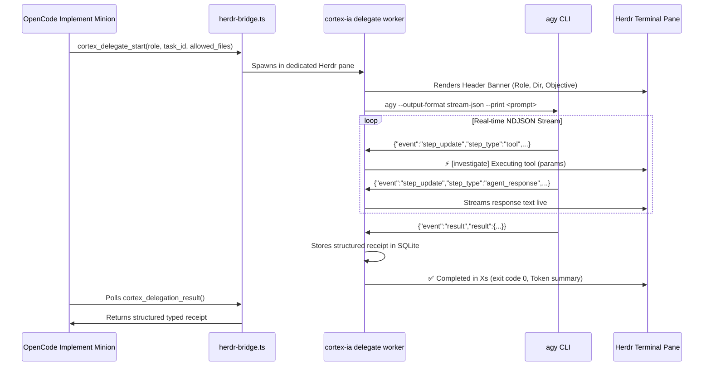

# Architecture Deep-Dive

**Cortex-IA** is the deterministic multi-agent control plane, transactional installer, and local process bridge for **OpenCode** and **Herdr**.

```text
┌─────────────────────────────────────────────────────────────────────────────────────────────┐
│                                   CORTEX-IA LAYERED ARCHITECTURE                            │
│                                                                                             │
│  ┌───────────────────────────────────────────────────────────────────────────────────────┐  │
│  │ 1. PRESENTATION PLANE                                                                 │  │
│  │    • Interactive TUI (BubbleTea wizard)        • Embedded Web Console (SSE / REST)   │  │
│  │    • Multiplexed Herdr Terminal Panes          • Universal CLI Dispatcher            │  │
│  └───────────────────────────────────────────────────────────────────────────────────────┘  │
│                                            │                                                │
│                                            ▼                                                │
│  ┌───────────────────────────────────────────────────────────────────────────────────────┐  │
│  │ 2. CONTROL & COORDINATION PLANE (internal/delegation)                                 │  │
│  │    • SQLite STRICT + WAL ACID Store            • Monotonic CAS Revision Locks         │  │
│  │    • Task DAG (backlog ➔ ready ➔ in_progress)  • Ephemeral Claim Tokens (SHA-256)     │  │
│  │    • Exclusive Workspace File Leases           • Independent Review Gates (Approve)   │  │
│  └───────────────────────────────────────────────────────────────────────────────────────┘  │
│                                            │                                                │
│                                            ▼                                                │
│  ┌───────────────────────────────────────────────────────────────────────────────────────┐  │
│  │ 3. SPECIFICATION PLANE (OpenSpec)                                                     │  │
│  │    • RFC 2119 Delta Requirements               • Change Proposals & Design Docs       │  │
│  │    • Tasks Specification (DAG Decompositions)  • Schema & Contract Validator          │  │
│  └───────────────────────────────────────────────────────────────────────────────────────┘  │
│                                            │                                                │
│                                            ▼                                                │
│  ┌───────────────────────────────────────────────────────────────────────────────────────┐  │
│  │ 4. EPISTEMIC & EVIDENCE PLANE (Cortex MCP)                                            │  │
│  │    • AST Code Symbol Graph & Relationships     • Blast Radius Impact Tree Engine      │  │
│  │    • Durable Bug & ADR Observations            • Session Lifecycle Demarcation        │  │
│  └───────────────────────────────────────────────────────────────────────────────────────┘  │
└─────────────────────────────────────────────────────────────────────────────────────────────┘
```

---

## 1. Package Structure & Responsibilities

```text
cmd/cortex-ia/               Entry point main(): release versioning + app bootstrap
internal/
├── app/                     CLI command routers (board, work, delegate, openspec, mcp, web)
├── delegation/              ACID SQLite engine: DAG, claims, leases, reviews, worker runner
├── cortexiaweb/             Embedded HTTP web server with SSE live event stream
├── herdr/                   Herdr workspace discovery, pane splitting & multiplexing
├── agents/opencode/         OpenCode configuration layout & safe asset path mapping
├── components/filemerge/    Safe JSONC three-way merger with comment preservation
├── mcpmanager/              Managed MCP server catalog (cortex, context7)
├── pipeline/                Transactional engine: Plan, Backup, Apply, Rollback
├── backup/                  Snapshot capture, manifest verification & restore
├── state/                   Home metadata, installation accreditation & cross-process locks
├── tui/                     Terminal User Interface (BubbleTea)
└── assets/                  Embedded runtime assets (AGENTS.md, agents, commands, skills, plugins)
web/                         Preact SPA source (compiled into internal/cortexiaweb/static)
```

---

## 2. Concurrency & Optimistic Locking Engine (`internal/delegation`)

Cortex-IA uses zero-CGO SQLite (`modernc.org/sqlite`) configured in `WAL` journal mode with `busy_timeout=5000` and a single-connection mutex (`SetMaxOpenConns(1)`):

### A. Monotonic CAS Revisions
Every work item tracks an integer `revision`. State transitions (`claim`, `transition`, `approve`, `retry`) use atomic `BEGIN IMMEDIATE` transactions with Compare-And-Swap (CAS) checks:
```sql
UPDATE work_items 
SET status = ?, revision = revision + 1, updated_at = ? 
WHERE id = ? AND revision = ?;
```
If a concurrent process modified the task in the interim, the operation fails with a typed `ErrStaleRevision` conflict rather than creating a silent race condition.

### B. Cryptographic Token Hashes
- **Claims**: When an agent claims a task (`work claim`), a 256-bit secure random token is generated and returned to the caller. Only the SHA-256 digest (`tokenHash`) is stored in SQLite.
- **File Leases**: When reserving exclusive files (`work lease`), a distinct `lease_token` is generated.
- **Verification**: To renew or transition a task, the agent must present the raw in-memory token. Tokens are never persisted to disk, git, or Cortex MCP.

### C. Automated Dependency Unlocking
When a reviewer records a `PASS` approval via `work approve`:
1. The task status atomically shifts from `in_review` to `done`.
2. All active file leases are purged.
3. The engine invokes `unlockDependents`, finding all downstream tasks in `backlog` whose dependencies are now 100% satisfied and transitioning them to `ready`.

---

## 3. Real-Time Worker Streaming (`internal/delegation/runner.go`)

When an external leaf worker (e.g. `agy`) is launched in a Herdr pane or background process:



---

## 4. Transactional File Installation Pipeline (`internal/pipeline`)

Every configuration modification follows an ACID pipeline:

1. **Plan**: Analyzes target home, detects unmanaged conflicts, and generates an immutable execution plan.
2. **Lock**: Acquires a cross-process lock (`LockFileEx` on Windows, `flock` on Unix) on `~/.cortex-ia/lock`.
3. **Backup**: Captures a snapshot manifest of every file to be touched into `~/.cortex-ia/backups/<timestamp>/`.
4. **Apply**: Atomically applies writes using temporary files and filesystem renames. JSONC configuration files are three-way merged, preserving user comments.
5. **Rollback on Error**: If any step in Apply fails, the engine immediately reverts all touched files from the verified backup snapshot before returning an error.
