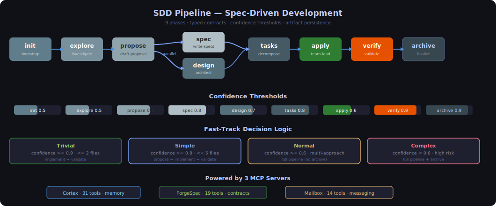
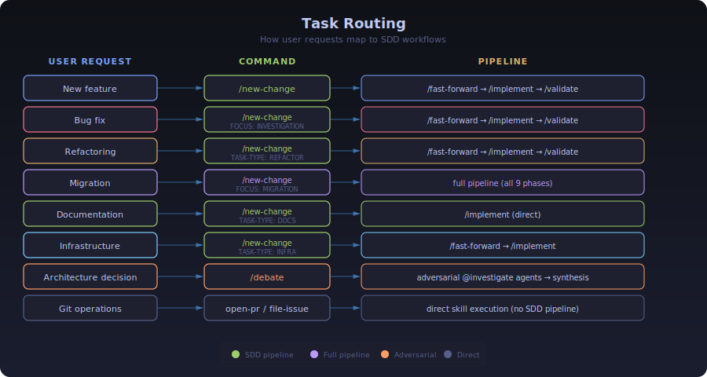
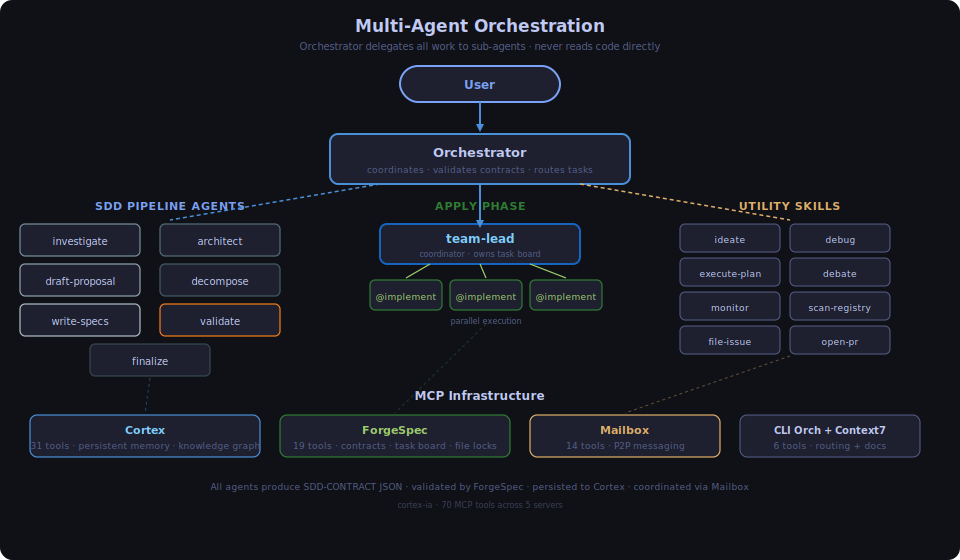

# SDD Workflow

Spec-Driven Development (SDD) is a structured 9-phase pipeline for substantial software changes. It enforces typed contracts, tracks dependencies, and provides artifact persistence across sessions.

## Pipeline

<p align="center">
  
</p>

### Dependency Graph

```
proposal → spec ──┐
         ↘        ├→ tasks → apply → verify → archive
         design ──┘
```

Spec and design depend on the proposal but are independent of each other.

## Phases

### 1. Init (`/sdd-init`)
**Agent**: bootstrap | **Confidence threshold**: 0.5

Detects project stack (languages, frameworks, test runners), bootstraps persistence mode (cortex/openspec/hybrid/none), builds skill registry.

### 2. Explore (`/sdd-explore <topic>`)
**Agent**: investigate | **Confidence threshold**: 0.5

Reads codebase, compares approaches, rates effort/risk. Uses Context7 for library docs and `mem_timeline` for temporal context. No files created.

### 3. Propose (`/sdd-new <change>`)
**Agent**: draft-proposal | **Confidence threshold**: 0.7

Creates change proposal with intent, scope, approach, affected areas, risks, rollback plan, success criteria. Uses Skeleton-of-Thought: outline → validate → expand.

### 4. Spec (`/sdd-continue`)
**Agent**: write-specs | **Confidence threshold**: 0.8

Writes delta specifications (ADDED/MODIFIED/REMOVED) with Given/When/Then scenarios. Uses RFC 2119 keywords.

### 5. Design (`/sdd-continue`)
**Agent**: architect | **Confidence threshold**: 0.7

Technical design with architecture decisions, data flow, file changes, interfaces. Uses Extended Thinking with explicit trade-off analysis of 2+ alternatives.

### 6. Tasks (`/sdd-continue`)
**Agent**: decompose | **Confidence threshold**: 0.8

Breaks specs + design into phased, dependency-ordered tasks. Identifies parallel groups and integration points.

### 7. Apply (`/sdd-implement`)
**Agent**: team-lead → implement | **Confidence threshold**: 0.6

Team-lead coordinates parallel @implement agents via task board. Uses `file_check` → `file_reserve` to prevent conflicts. Each implement agent uses Constitutional Self-Critique before submitting.

### 8. Verify (`/sdd-validate`)
**Agent**: validate | **Confidence threshold**: 0.9

Validates implementation against specs. Runs tests, generates compliance matrix. Uses Chain-of-Verification: list claims → verify independently → correct.

### 9. Archive (`/sdd-finalize`)
**Agent**: finalize | **Confidence threshold**: 0.9

Merges delta specs, closes change cycle, generates retrospective. Cleans up obsolete Cortex observations via `mem_archive`.

## Task Routing

<p align="center">
  
</p>

## Commands

### Skill commands (appear in autocomplete)
- `/sdd-init` — Initialize SDD context
- `/sdd-explore <topic>` — Investigate an idea
- `/sdd-apply [change]` — Implement tasks
- `/sdd-verify [change]` — Validate implementation
- `/sdd-archive [change]` — Close change

### Meta-commands (orchestrator handles directly)
- `/sdd-new <change>` — Start new change (explore → propose)
- `/sdd-continue [change]` — Run next dependency-ready phase
- `/sdd-ff <name>` — Fast-forward planning (propose → spec → design → tasks)

## Contract Validation

Every phase produces a JSON contract validated by ForgeSpec:

```json
{
  "schema_version": "1.0",
  "phase": "explore",
  "change_name": "add-auth",
  "project": "my-project",
  "status": "success",
  "confidence": 0.85,
  "executive_summary": "...",
  "artifacts_saved": [{"topic_key": "sdd/add-auth/explore", "type": "cortex"}],
  "next_recommended": ["propose"],
  "risks": [{"description": "...", "level": "medium"}]
}
```

Validation flow:
1. `sdd_validate(phase, contract)` — verify schema and confidence threshold
2. `sdd_save(contract, project)` — persist to ForgeSpec history
3. `sdd_history(project)` — audit trail across sessions

## Artifact Persistence

### Topic Key Format
```
sdd/{change-name}/{artifact-type}
```

| Phase | Topic Key | Example |
|-------|-----------|---------|
| init | `bootstrap/{project}` | `bootstrap/auth-service` |
| explore | `sdd/{change}/explore` | `sdd/add-auth/explore` |
| propose | `sdd/{change}/proposal` | `sdd/add-auth/proposal` |
| spec | `sdd/{change}/spec` | `sdd/add-auth/spec` |
| design | `sdd/{change}/design` | `sdd/add-auth/design` |
| tasks | `sdd/{change}/tasks` | `sdd/add-auth/tasks` |
| apply | `sdd/{change}/apply-progress` | `sdd/add-auth/apply-progress` |
| verify | `sdd/{change}/verify-report` | `sdd/add-auth/verify-report` |
| archive | `sdd/{change}/archive-report` | `sdd/add-auth/archive-report` |

### Two-Step Read (Critical)
`mem_search` returns 300-char previews only. Always follow with:
```
1. mem_search(query: "{topic-key}", project: "{project}") → observation ID
2. mem_get_observation(id: {id}) → full content
```

## Orchestrator Variants

<p align="center">
  
</p>

### Multi-Agent (Claude Code, OpenCode)
The orchestrator is a pure coordinator — delegates ALL work to sub-agents via Task tool. Uses:
- `agent_register` for P2P discovery
- `cli_route` + `cli_execute` for external CLI cross-validation
- `mem_capture_passive` for automatic learning extraction
- `tb_list` for board recovery after compaction

### Single-Agent (Gemini, Codex, Windsurf, Cursor, VS Code, Antigravity)
The agent executes all 9 phases sequentially itself. Uses the same Cortex, ForgeSpec, and Mailbox tools but without delegation.

## Prompting Techniques

| Technique | Where | Why |
|-----------|-------|-----|
| Chain-of-Verification | validate | Verify claims independently before output (30-50% fewer hallucinations) |
| Constitutional Self-Critique | implement | Critique code against specs, design, patterns, security before submitting |
| Skeleton-of-Thought | draft-proposal, write-specs | Outline → validate completeness → expand (fewer omissions) |
| Extended Thinking | architect, decompose | Explicit 2+ alternatives with trade-off matrix |
| ReAct | debug | Thought → Action → Observation loops grounded in evidence |
| Step-Back | architect | Abstract principles before specific design (7-27% better reasoning) |
| Inline WHY | all rules | Motivation on every rule improves compliance |
