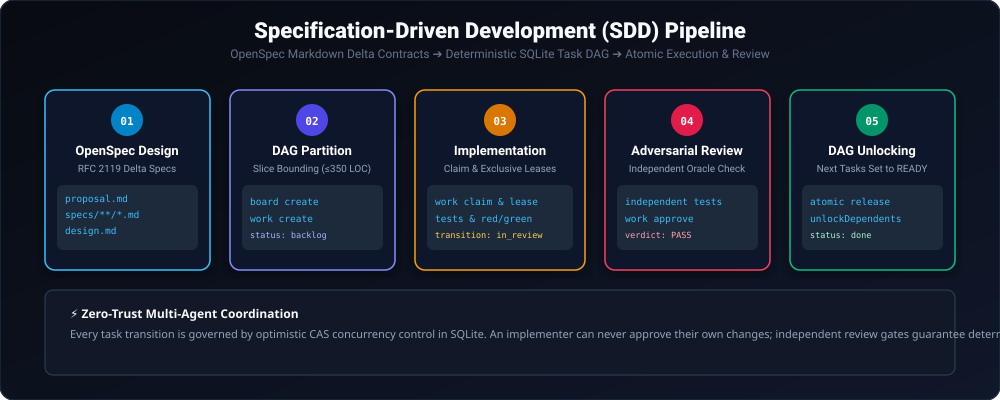
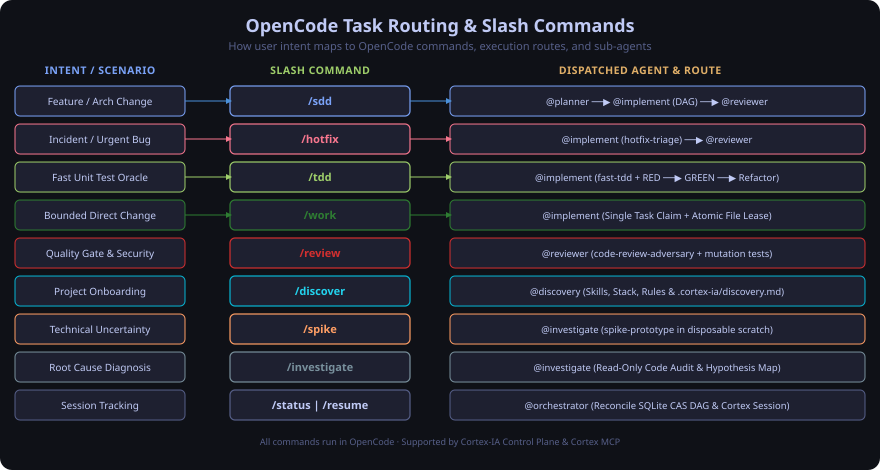
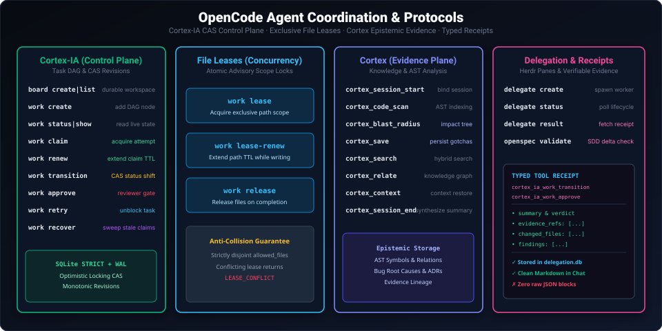

# SDD Workflow

Spec-Driven Development (SDD) is a structured 9-phase pipeline (Phase 0 init prerequisite + 8 main phases, 1-8) for substantial software changes. ForgeSpec owns contracts and authoritative task state, Cortex owns durable evidence, and runtime-native dispatch owns child transport only. cortex-ia compiles and installs workflow assets but does not schedule or execute the pipeline.

## Pipeline

<p align="center">
  
</p>

### Dependency Graph

```
proposal → spec ──┐
         ↘        ├→ tasks → apply → verify → archive
         design ──┘
```

Spec and design depend on the proposal but are independent of each other.

## Phases

### 0. Init (`/sdd-init`) — prerequisite
**Agent**: bootstrap | **Confidence threshold**: 0.5

Detects project stack (languages, frameworks, test runners), bootstraps persistence mode (cortex/openspec/hybrid/none), builds skill registry.

### 1. Explore (`/sdd-explore <topic>`)
**Agent**: investigate | **Confidence threshold**: 0.5

Reads codebase, compares approaches, rates effort/risk. Uses Context7 for library docs and `mem_timeline` for temporal context. No files created.

### 2. Propose (`/sdd-new <change>`)
**Agent**: draft-proposal | **Confidence threshold**: 0.7

Creates change proposal with intent, scope, approach, affected areas, risks, rollback plan, success criteria. Uses Skeleton-of-Thought: outline → validate → expand.

### 3. Spec (`/sdd-continue`)
**Agent**: write-specs | **Confidence threshold**: 0.8

Writes delta specifications (ADDED/MODIFIED/REMOVED) with Given/When/Then scenarios. Uses RFC 2119 keywords.

### 4. Design (`/sdd-continue`)
**Agent**: architect | **Confidence threshold**: 0.7

Technical design with architecture decisions, data flow, file changes, interfaces. Uses Extended Thinking with explicit trade-off analysis of 2+ alternatives.

### 5. Tasks (`/sdd-continue`)
**Agent**: decompose | **Confidence threshold**: 0.8

Breaks specs + design into phased, dependency-ordered tasks. Identifies parallel groups and integration points.

### 6. Apply (`/sdd-implement`)
**Agent**: implement | **Confidence threshold**: 0.6

The orchestrator routes a ForgeSpec-ready task directly to `implement`. The implement agent reserves only its files, owns one bounded vertical work unit, verifies it, reports status, and releases reservations. The historical `team-lead` role is retired and removed from every current profile.

### 7. Verify (`/sdd-validate`)
**Agent**: validate | **Confidence threshold**: 0.9

Validates implementation against specs. Runs tests, generates compliance matrix. Uses Chain-of-Verification: list claims → verify independently → correct.

### 8. Archive (`/sdd-finalize`)
**Agent**: finalize | **Confidence threshold**: 0.9

Merges delta specs, closes change cycle, generates retrospective. Cleans up obsolete Cortex observations via `mem_archive`.

## Task Routing

<p align="center">
  
</p>

## Commands

### Skill commands (appear in autocomplete)
- `/sdd-init` — Initialize SDD context
- `/sdd-explore <topic>` — Investigate an idea
- `/sdd-apply [change]` — Implement tasks
- `/sdd-verify [change]` — Validate implementation
- `/sdd-archive [change]` — Close change

### Meta-commands (orchestrator handles directly)
- `/sdd-new <change>` — Start new change (explore → propose)
- `/sdd-continue [change]` — Run next dependency-ready phase
- `/sdd-ff <name>` — Fast-forward planning (propose → spec → design → tasks)

## Contract Validation

Every phase produces a JSON contract validated by the external ForgeSpec service. ForgeSpec is an explicit upstream dependency; cortex-ia configures the binding and does not implement a local substitute:

```json
{
  "schema_version": "1.0",
  "phase": "explore",
  "change_name": "add-auth",
  "project": "my-project",
  "status": "success",
  "confidence": 0.85,
  "executive_summary": "...",
  "artifacts_saved": [{"topic_key": "sdd/add-auth/explore", "type": "cortex"}],
  "next_recommended": ["propose"],
  "risks": [{"description": "...", "level": "medium"}]
}
```

Validation flow:
1. `sdd_validate(phase, contract)` — verify schema and confidence threshold
2. `sdd_save(contract, project)` — persist to ForgeSpec history
3. `sdd_history(project)` — audit trail across sessions

## Artifact Persistence

### Topic Key Format
```
sdd/{change-name}/{artifact-type}
```

| Phase | Topic Key | Example |
|-------|-----------|---------|
| init | `bootstrap/{project}` | `bootstrap/auth-service` |
| explore | `sdd/{change}/explore` | `sdd/add-auth/explore` |
| propose | `sdd/{change}/proposal` | `sdd/add-auth/proposal` |
| spec | `sdd/{change}/spec` | `sdd/add-auth/spec` |
| design | `sdd/{change}/design` | `sdd/add-auth/design` |
| tasks | `sdd/{change}/tasks` | `sdd/add-auth/tasks` |
| apply | `sdd/{change}/apply-progress` | `sdd/add-auth/apply-progress` |
| verify | `sdd/{change}/verify-report` | `sdd/add-auth/verify-report` |
| archive | `sdd/{change}/archive-report` | `sdd/add-auth/archive-report` |
| retrospective | `sdd/{change}/retrospective` | `sdd/add-auth/retrospective` |

### Two-Step Read (Critical)
`mem_search` returns 300-char previews only. Always follow with:
```
1. mem_search(query: "{topic-key}", project: "{project}") → observation ID
2. mem_get_observation(id: {id}) → full content
```

## Capability Profiles

| Profile | Minimum qualified capability | Scheduling assumption |
|---------|------------------------------|-----------------------|
| `portable-sequential` | None | One agent follows dependency order; no delegation required |
| `portable-flat` | Fresh proven direct-child delegation | Direct children only; no nesting or runtime DAG assumption |
| `native-advanced` | Every requested native capability; explicit opt-in for each experimental capability | Only the target-specific behavior recorded in its manifest |

Experimental native behavior is always opt-in, even after qualification. Stale facts, documentation-only evidence, or prompt-only guidance cannot upgrade a profile. The generated security and degradation manifests show the selected profile, capability states (`native|emulated|advisory|unsupported`), enforcement (`runtime|hook|mcp|prompt|none`), substitutions, evidence, permissions, service requirements, and findings before installation.

## Apply Phase

1. ForgeSpec determines task dependencies/readiness and owns claim/status state.
2. The orchestrator selects a ready task reference and dispatches `implement` directly.
3. `implement` reserves its exact files, completes one bounded work unit, and records evidence/status.
4. `validate` independently checks the resulting behavior and evidence.

Runtime-native dispatch and Agent Mailbox are non-authoritative transport. ForgeSpec remains authoritative for task state.

## Direct Coordination

<p align="center">
  
</p>

ForgeSpec `direct-v1` is selected only from fresh compatible P0 capability evidence. ForgeSpec 1.2.x may run visibly as `legacy-sequential`; missing or stale required evidence blocks. Optional file-reservation capability may degrade to sequential/no-concurrent-write execution. No local scheduler or competing task-state authority is created.

Agent Mailbox user data, WAL/SHM files, caches, archives, and repository checkout are never automatically deleted.

## Quality Policy

Planning depth depends on change type, observable behavior, risk, reversibility, trust boundary, dependency breadth, migration impact, and required evidence—not model confidence alone. Behavior-changing work uses vertical RED/GREEN/REFACTOR only when a deterministic focused runner, writable tests, and baseline evidence are available; otherwise it records an explicit recognized exception with compensating evidence.

Use Gherkin selectively for stakeholder-visible generation, installation, diagnostic, degradation, or rollback behavior. Use unit, contract, property, fuzz, or golden tests for schemas and internal invariants. Mutation is conditional and budgeted; property/fuzz tests require meaningful invariants or untrusted input surfaces. Timeout, flakes, missing capability, cancellation, insufficient trials, and exhausted budgets remain inconclusive or degraded and must never be converted to pass.

## Installation, Migration, and Rollback

The compiler emits deterministic target assets and semantic/security/degradation manifests. Dry-run and apply share the same immutable install plan. Doctor must qualify the planned profile, service versions, evidence freshness, bindings, permissions, hashes, ownership, and manifests before mutation. Installation creates a verified backup, preserves content outside managed regions, uses three-way merge for managed customization, and blocks conflicts.

Major cutover migrates generated assets and configuration only. It does **not** migrate live sessions, in-flight tasks, attempts, leases, scheduler state, or runtime telemetry. Rollback requires an explicitly selected backup, restores managed bytes and compatibility metadata, preserves conflict-free unmanaged changes, reports conflicts, and re-runs doctor against the restored bundle.

## Prompting Techniques

| Technique | Where | Why |
|-----------|-------|-----|
| Chain-of-Verification | validate | Verify claims independently before output (30-50% fewer hallucinations) |
| Constitutional Self-Critique | implement | Critique code against specs, design, patterns, security before submitting |
| Skeleton-of-Thought | draft-proposal, write-specs | Outline → validate completeness → expand (fewer omissions) |
| Extended Thinking | architect, decompose | Explicit 2+ alternatives with trade-off matrix |
| ReAct | debug | Thought → Action → Observation loops grounded in evidence |
| Step-Back | architect | Abstract principles before specific design (7-27% better reasoning) |
| Inline WHY | all rules | Motivation on every rule improves compliance |
