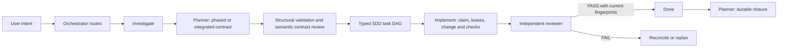

# Specification-driven development in Cortex-IA

The [canonical workflow map](../internal/assets/skills/_shared/workflow-map.md) defines every route, role, phase artifact, validation gate and completion condition. It is installed as `~/.cortex-ia/opencode/contracts/workflow-map.md`; agents and `/sdd` use that same source.

Cortex-IA separates the specification plane (OpenSpec, Cortex, or hybrid), durable work authority in SQLite, and evidence. SDD means contracts precede implementation and the accepted change is traceable to those contracts. A board, a successful build or a completed subagent alone does not establish SDD compliance.

```mermaid
flowchart LR
  A[User intent] --> B[Orchestrator routes]
  B --> C[Investigate]
  C --> D[Planner: phased or integrated contract]
  D --> E[Structural validation and semantic contract review]
  E --> F[Typed SDD task DAG]
  F --> G[Implement: claim, leases, change and checks]
  G --> H[Independent reviewer]
  H -->|PASS with current fingerprints| I[Done]
  H -->|FAIL| J[Reconcile or replan]
  I --> K[Planner: durable closure]
```

## Verification is layered

- Structural validation checks phase-specific files, unique requirement IDs, complete scenario fields and task references. It does not assess whether scenarios are meaningful or code is correct.
- Native mutation tools require session-owned live task authority. This admission check is not an operating-system sandbox for shell commands.
- Persistent test policy strictly bounds persistent suites to TUI, simple install-copy, and user-authorized critical regression boundaries (authority, transport, recovery, updater verification). Tests must use temporary home directories and synthetic inputs, keep dedicated test files <= 250 lines without appending to files > 300 lines, and never weaken contracts (such as silently skipping invalid records) or touch real developer state. Deeper unrelated transactional exploration remains ephemeral.
- SDD work stores typed contract pins and requirement IDs. Review records runtime-computed definition and writable-file fingerprints. Historical approvals retain their original evidence.
- The reviewer retrieves the selected specification, evaluates the change and reruns appropriate checks. Remote Cortex content freshness is verified through its selected transport, not inferred from a stored hash.
- Planner closes the change using `cortex_ia_change_archive` after durable approval and current fingerprint checks. Cortex-only closure is logical; OpenSpec/hybrid also archive the source change directory.

Direct changes use proportional verification without invented SDD pins. An initiative should only be described as completed SDD when its contract, work, review and closure evidence exist.
