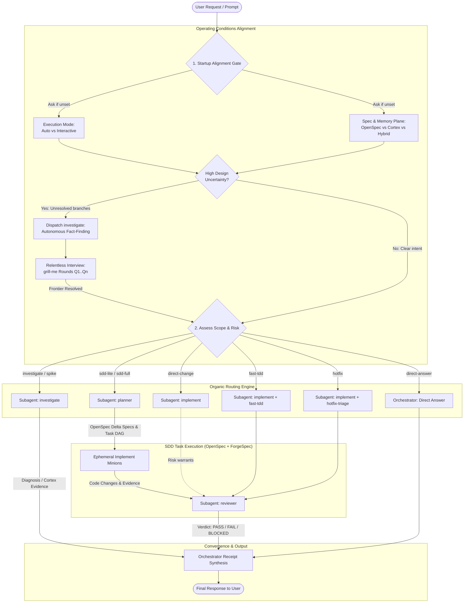
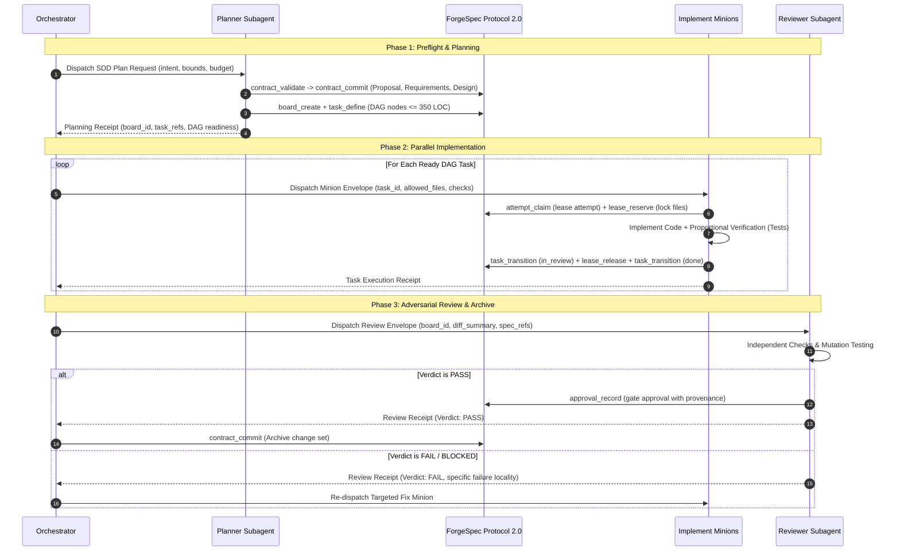
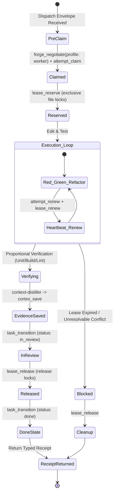
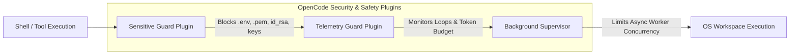

# OpenCode Adaptive Development Harness

- **Primary engine**: `orchestrator`
- **Version**: `2.3.0`
- **Active roles**: `orchestrator`, `investigate`, `planner`, `implement`, `reviewer`
- **Specification plane**: OpenSpec (`openspec/specs/`, `openspec/changes/<change-name>/`)
- **Control plane**: ForgeSpec Protocol 2.0 (`forgespec-mcp@2.0.0`, 18 tools, signed identity broker)
- **Evidence & Graph plane**: Cortex (Durable SQLite memory, AST knowledge graph & blast radius, 28 tools)
- **Canonical ForgeSpec protocol**: `skills/_shared/forgespec-protocol.md` (single normative source: 18-tool catalog, 4 deterministic profiles, signed identity broker, attempt lifecycle, optimistic file leases, gate approvals)

---

## 1. Session Startup Alignment & Subagent Topology Model

The `orchestrator` is the sole coordinator and delegation authority in OpenCode. Every session or coordinated initiative begins with an operational alignment gate:



### Startup Conditioning Rules
1. **Execution Mode**:
   - **`auto`**: Autonomous execution through the task DAG until all nodes pass or a hard blocker / approval gate is reached.
   - **`interactive`**: Explicit user review and sign-off required at each phase transition (plan approval -> task dispatch -> review verdict).
2. **Spec & Memory Plane**:
   - **`openspec`**: Human-readable markdown files under `openspec/specs/` and `openspec/changes/<name>/` (`proposal.md`, `specs/`, `design.md`, `tasks.md`, `archive/`).
   - **`cortex`**: Persistent SQLite knowledge graph (`cortex_save`/`cortex_search`/`cortex_graph`) for durable debugging memory, root causes, AST relationships, and blast radius analysis.
   - **`hybrid`**: *(Recommended)* OpenSpec for shared markdown specifications in the repo + Cortex for debugging memory and root-cause lineage.
3. **Design Grilling (`grill-me`)**:
   - When encountering unstated architectural choices or trade-offs, execute structured interview rounds:
     `❓ Q1 - <Title>: <Options>` + `➡️ Recomendación: <Answer>`.
   - Autonomous fact-finding is strictly delegated to the `investigate` subagent: the orchestrator holds no inspection tools and never reads code directly, nor does it ask the user for data that `investigate` can discover in the repository.

### Role Consolidation Matrix

| Role | Mode | Primary Responsibility | Permitted Delegations | Tool Surface Highlights |
|---|---|---|---|---|
| **`orchestrator`** | `primary` | Request triage, startup alignment, organic routing, Cortex session lifecycle, DAG dispatch, final response synthesis | `investigate`, `planner`, `implement`, `reviewer` | `cortex_*`, `board_create`, `task_define`, `task_query`, `attempt_recover`, `authority_manage`, `event_query`, `contract_query`, `task` (subagent dispatch), `skill` (`grill-me`) |
| **`investigate`** | `subagent` | Repository diagnostics, root-cause analysis, exploratory spikes, read-only audit | *None (Leaf)* | `read`, `grep`, `glob`, `list`, `bash` (read-only diagnostics), `cortex_*`, `contract_query`, `task_query`, `event_query` |
| **`planner`** | `subagent` | OpenSpec delta requirements (RFC 2119), Given/When/Then scenarios, task DAG decomposition (<=350 LOC) | *None (Leaf)* | `read`, `grep`, `glob`, `list`, `edit` (`openspec/`), `bash`, `board_create`, `task_define`, `task_query`, `contract_validate`, `contract_commit`, `cortex_*` |
| **`implement`** | `subagent` | Ephemeral minion: claims single task, reserves file lease, implements code, runs unit oracles, releases lease | *None (Leaf)* | `read`, `grep`, `glob`, `list`, `edit`, `bash` (tests, builds, linters), `attempt_claim`, `attempt_renew`, `lease_reserve`, `lease_renew`, `lease_release`, `task_transition`, `cortex_*` |
| **`reviewer`** | `subagent` | Independent adversarial verification, mutation testing, invariant checking, gate approvals (`approval_record`) | *None (Leaf)* | `read`, `grep`, `glob`, `list`, `bash` (independent test runs), `contract_query`, `task_query`, `event_query`, `approval_record`, `cortex_*` |

---

## 2. Organic Routing Policy

Choose the smallest workflow that safely fits the request. File count is evidence, never the sole routing rule.

| Route | Use when | Execution Sequence | Typical Skills |
|---|---|---|---|
| `direct-answer` | Read-only questions, documentation lookup, simple status | `orchestrator` | `orchestrator` |
| `investigate` | Diagnosis, root-cause audit without immediate file edits | `orchestrator -> investigate -> orchestrator` | `investigate`, `context-distiller` |
| `spike` | Bounded experiment to reduce material technical uncertainty | `orchestrator -> investigate (spike) -> orchestrator` | `spike-prototype`, `investigate` |
| `direct-change` | Clear, reversible, single-domain change with fast verification | `orchestrator -> implement -> (reviewer) -> orchestrator` | `implement` |
| `fast-tdd` | Localized functional unit with deterministic oracle | `orchestrator -> implement -> reviewer -> orchestrator` | `fast-tdd`, `ast-impact-analysis` |
| `hotfix` | Urgent production or service containment | `orchestrator -> implement -> reviewer -> orchestrator` | `hotfix-triage`, `implement` |
| `sdd-lite` | Moderate risk, single domain, multi-file feature | `orchestrator -> planner -> implement minions -> reviewer -> orchestrator` | `planner`, `implement`, `reviewer` |
| `sdd-full` | High risk, cross-domain, public API, security, migration | `orchestrator -> investigate -> planner -> implement minions -> dual reviewer -> orchestrator` | Full SDD skill suite |
| `review` | Dedicated independent audit of an existing diff or branch | `orchestrator -> reviewer -> orchestrator` | `code-review-adversary`, `mutation-testing` |

---

## 3. SDD Lifecycle & Preflight Gate



### Review Workload Guard & Stacked Units
- **Line Count Limits**:
  - Concise languages (TS, Python): max **<= 350 lines** per task node.
  - Typed/verbose languages (Go, Rust, Java): max **<= 500 lines** per task node.
- **Stacked Work Units**:
  1. *Layer 1 (Contracts)*: Types, interfaces, schemas, and test scaffolding.
  2. *Layer 2 (Core)*: Domain business logic and internal algorithmic engines.
  3. *Layer 3 (Integration)*: Public APIs, CLI/TUI wiring, and integration tests.

---

## 4. Implementation Minion Lifecycle & File Lease Protocol

An implementation minion is an ephemeral instance of `implement`. It owns strictly ONE task attempt.



### Canonical Minion Invariants
1. **Live Authority Only**: `claim_token`, `lease_id`, and `lease_token` are kept strictly in live memory; they are NEVER persisted to Cortex or logs.
2. **Immediate Stop on Expiry**: If a heartbeat or file lease renewal fails, the minion MUST stop writing immediately, preserve the diff, and return `BLOCKED`.
3. **Mandatory Cleanup**: File leases must be released on all outcomes (`PASS`, `FAIL`, `BLOCKED`, timeout).

---

## 5. Dispatch Envelope & Receipt Schemas

### Orchestrator -> Minion Dispatch Envelope
```json
{
  "objective": "Implement user authentication middleware",
  "workflow": "fast-tdd",
  "phase": "integrated | propose | spec | design | tasks | apply | verify",
  "task_id": "task-auth-001",
  "artifact_refs": ["specs/auth/REQ-AUTH-001.md"],
  "evidence_refs": ["cortex/gotchas/jwt-expiry"],
  "non_goals": ["OAuth2 multi-tenant providers"],
  "allowed_files": [
    "internal/auth/middleware.go",
    "internal/auth/middleware_test.go"
  ],
  "allowed_effects": ["create", "edit"],
  "required_skill": "fast-tdd",
  "skills_to_load": ["fast-tdd", "ast-impact-analysis"],
  "acceptance_checks": [
    "go test -run TestAuthMiddleware ./internal/auth/...",
    "golangci-lint run ./internal/auth/..."
  ],
  "budget": { "max_turns": 30, "max_retries": 1, "max_lines": 350 },
  "stop_conditions": ["Unresolvable dependency cycle", "Missing crypto library"],
  "escalate_when": ["External auth provider unreachable"]
}
```

### Minion -> Orchestrator Execution Receipt
```json
{
  "receipt_version": "2.0",
  "task_id": "task-auth-001",
  "phase_status": "success",
  "task_status": "done",
  "verification_verdict": "PASS",
  "changed_files": [
    "internal/auth/middleware.go",
    "internal/auth/middleware_test.go"
  ],
  "evidence_refs": ["auth/middleware-unit-pass"],
  "verification_commands": [
    {
      "command": "go test -v ./internal/auth/...",
      "exit_code": 0,
      "oracle_type": "unit"
    }
  ],
  "cleanup_completed": true,
  "deviations": [],
  "risks": []
}
```

---

## 6. Status Dimensions

Status is tracked across 3 orthogonal dimensions that must never be collapsed:

```
+---------------------+---------------------------------------------------------------+
| Dimension           | Allowed States                                                |
+---------------------+---------------------------------------------------------------+
| phase_status        | success | partial | failed | blocked                          |
| task_status         | backlog | ready | in_progress | in_review | done | blocked  |
| verification_verdict| PASS | FAIL | BLOCKED | INCONCLUSIVE                            |
+---------------------+---------------------------------------------------------------+
```

- `INCONCLUSIVE` is never promoted to `PASS`.
- Narrative claims in responses are untrusted; only deterministic tool execution acts as evidence.

---

## 7. Safety, Shell Boundaries & Guard Plugins



### Shell Permission Boundaries
- **Pre-Approved (No confirmation needed)**:
  - Git reads (`git status`, `git diff`, `git log`).
  - Read-only diagnostics (database queries, schema discovery).
  - Test suites, compilers, build runners, linters, static analyzers.
- **Strictly Requiring Explicit User Approval**:
  - File/Directory deletion (`rm -rf`, `os.RemoveAll`).
  - Destructive SQL (`DROP`, `DELETE FROM`, `TRUNCATE`).
  - Package uninstallation, `git clean -fd`, `git reset --hard`, `git push --force`.
  - Deployment or remote publishing.
- **Orchestrator Shell Rule**: The orchestrator holds NO shell permission directly; it always delegates operational work to leaf minions.

