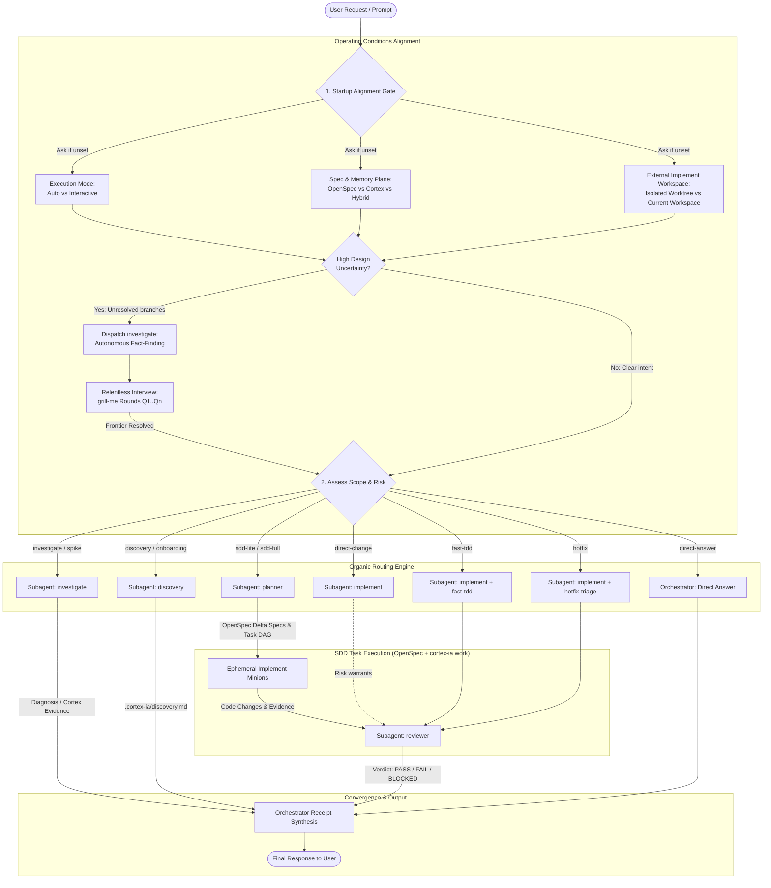
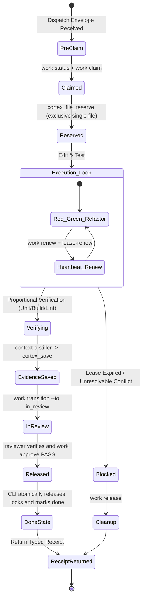
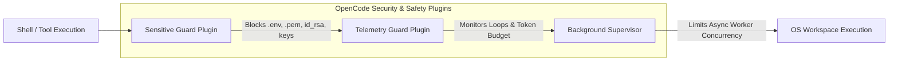

# OpenCode Adaptive Development Harness

- **Primary engine**: `orchestrator`
- **Version**: `2.4.0`
- **Active roles**: `orchestrator`, `discovery`, `investigate`, `planner`, `implement`, `reviewer`
- **Specification plane**: OpenSpec (`openspec/specs/`, `openspec/changes/<change-name>/`)
- **Control plane**: `cortex-ia work` CLI (SQLite DAG, CAS revisions, claims, leases, recovery, approvals)
- **Task-board plane**: `cortex-ia board` (durable grouping + embedded loopback web view; never an authority substitute)
- **Evidence & Graph plane**: Cortex (durable SQLite memory and AST knowledge graph; the active MCP schema is authoritative for tool count and arguments)
- **Canonical work protocol**: `~/.cortex-ia/opencode/contracts/cortex-work-protocol.md` (single normative source for roles, authority, delegation, and completion)
- **Evidence convention**: `~/.cortex-ia/opencode/contracts/cortex-convention.md` (durable memory, lineage, taxonomy, and recovery)
- **Codebase design contract**: `~/.cortex-ia/opencode/contracts/codebase-design-contract.md` (shared architecture vocabulary, dependency seams, design comparison, and task-graph boundaries)
- **Diagnosis loop contract**: `~/.cortex-ia/opencode/contracts/diagnosis-loop-contract.md` (red-capable reproduction, minimization, falsifiable hypotheses, and regression-seam rules)
- **Agent writing contract**: `~/.cortex-ia/opencode/contracts/agent-writing-contract.md` (context pointers, progressive disclosure, completion criteria, and single-source instruction design)

---

## 1. Session Startup Alignment & Subagent Topology Model

The `orchestrator` is the sole coordinator and delegation authority in OpenCode. Every session or coordinated initiative begins with an operational alignment gate:



### Startup Conditioning Rules
1. **Execution Mode**:
   - **`auto`**: Autonomous execution through the task DAG until all nodes pass or a hard blocker / approval gate is reached.
   - **`interactive`**: Explicit user review and sign-off required at each phase transition (plan approval -> task dispatch -> review verdict).
2. **Spec & Memory Plane**:
   - **`openspec`**: Human-readable markdown files under `openspec/specs/` and `openspec/changes/<name>/` (`proposal.md`, `specs/`, `design.md`, `tasks.md`, `archive/`).
   - **`cortex`**: Persistent SQLite knowledge graph (`cortex_save`/`cortex_search`/`cortex_graph`) for durable debugging memory, root causes, AST relationships, and blast radius analysis.
   - **`hybrid`**: *(Recommended)* OpenSpec for shared markdown specifications in the repo + Cortex for debugging memory and root-cause lineage.
3. **External Implement Workspace Strategy**:
   - **`isolated_worktree`**: *(Recommended)* Run an external implement leaf in an existing clean related Git worktree.
   - **`current_workspace`**: Native implement controllers may share the workspace in parallel only with distinct claims and disjoint per-file `cortex_file_reserve` calls made before editing each file. An external AGY leaf remains exclusive during its execution window; its native controller must not edit concurrently, and Cortex-IA compares the final workspace against a pre-run baseline.
   - Ask when unset and carry the answer in every implement dispatch envelope. Never infer the strategy from an available worktree, Herdr, or delegation configuration.
4. **Design Grilling (`grill-me`)**:
   - When encountering unstated architectural choices or trade-offs, execute structured interview rounds:
     `❓ Q1 - <Title>: <Options>` + `➡️ Recomendación: <Answer>`.
   - Autonomous fact-finding is strictly delegated to the `investigate` subagent: the orchestrator holds no inspection tools and never reads code directly, nor does it ask the user for data that `investigate` can discover in the repository.
5. **Project Discovery Profile**:
   - The native `discovery` role owns `./.cortex-ia/discovery.md`. Dispatch it for project onboarding, explicit refresh, environment uncertainty, or a known stale profile.
   - The profile inventories installed skills, languages/project types, required engines, Cortex rule IDs/names, and evidence-backed architecture. It is a reviewable cache of observations, not authority: current manifests, repository evidence, active Cortex rules, and tool output win on conflict.
   - Planner, implementer, and reviewer envelopes carry the profile as an artifact reference. No other role may write it.

### Role Consolidation Matrix

| Role | Mode | Primary Responsibility | Permitted Delegations | Tool Surface Highlights |
|---|---|---|---|---|
| **`orchestrator`** | `primary` | Request triage, routing, Cortex session lifecycle, DAG dispatch, final synthesis | Native `discovery`, `investigate`, `planner`, `implement`, `reviewer` controllers | `task`, `skill`, `cortex_*`, `cortex_board_*`, read-only/recovery `cortex_work_*`; no decomposition, discovery writes, shell, or edits |
| **`discovery`** | `subagent/controller` | Project onboarding profile: skills, stack, engines, Cortex governance, architecture | None; always native | repository/machine reads, bounded version probes, Cortex queries, `cortex_discovery_write`; no builds, installs, ingestion, product edits, or nested `task` |
| **`investigate`** | `subagent/controller` | Repository diagnostics, red-capable reproduction, root-cause analysis, read-only workflow retrospective | One optional read-only AGY leaf | `read`, `grep`, `glob`, `list`, read-only `bash`, `cortex_*`, delegation read/wait tools; no edits or nested `task` |
| **`planner`** | `subagent/controller` | Decision maps, OpenSpec contracts, vertical-slice DAGs, and blocked-task replacement plans | One optional plan-only AGY leaf | repository reads, OpenSpec edits, `cortex_board_create`, `cortex_work_create`, `cortex_work_decompose`, `cortex_*`; no claims or nested `task` |
| **`implement`** | `subagent/controller` | Claims one task, leases paths, executes, verifies, transitions to review | One AGY leaf after durable authority and explicit workspace-strategy validation | edits plus hidden-token `cortex_work_claim|lease|renew|release|transition`, `cortex_*`; no nested `task` |
| **`reviewer`** | `subagent/controller` | Independent verification and approval | One optional read-only AGY audit leaf | repository reads, tests, `cortex_work_status`, `cortex_work_approve`, `cortex_*`; no edits, claims, leases, or nested `task` |

The orchestrator always routes through a native controller and never launches an external executor directly. Discovery is always native and cannot delegate. Cortex-IA is the only process bridge and local task authority. External leaves receive no work-control CLI, Cortex MCP, session lifecycle, authority tokens, or nested-delegation capability; their SQLite job state is operational evidence only.

### Effective Execution Mode Contract

The value returned by `cortex_delegate_start` is authoritative. Agents MUST NOT derive the effective mode from installer selections, `use_herdr`, CLI availability, or pane visibility.

| Mode | Agent behavior |
|---|---|
| `native` | No external job was accepted; the native role controller executes the objective. |
| `direct_cli` | Cortex accepted and launched AGY directly; the controller only supervises, validates, and retains control-plane authority. |
| `herdr_multiplexed` | Cortex accepted and launched AGY through Herdr; controller behavior is identical to `direct_cli`, with the pane serving only as presentation and multiplexing. |

After `delegated=true` plus `job_id`, no controller may perform the same objective concurrently or fall back natively because of failure, timeout, cancellation, a missing pane, or `lost`. It MUST reconcile the durable job first and may retry only explicitly under fresh authority. `use_herdr=true` is only a preference; Cortex may return `direct_cli` after a safe pre-acceptance fallback.

---

## 2. Organic Routing Policy

Choose the smallest workflow that safely fits the request. File count is evidence, never the sole routing rule.

| Route | Use when | Execution Sequence | Typical Skills |
|---|---|---|---|
| `direct-answer` | Read-only questions, documentation lookup, simple status | `orchestrator` | `orchestrator` |
| `discovery` | Project onboarding, environment readiness, or refresh of technical and architectural context | `orchestrator -> discovery -> orchestrator` | `discovery` |
| `investigate` | Diagnosis, root-cause audit without immediate file edits | `orchestrator -> investigate -> orchestrator` | `investigate`, `context-distiller` |
| `decision-map` | Multi-session destination whose decision frontier is not yet specifiable as an implementation DAG | `orchestrator -> investigate/human input -> planner (one decision) -> orchestrator` | `planner`, `investigate`, `grill-me`, `spike-prototype` |
| `spike` | Bounded experiment to reduce material technical uncertainty | `orchestrator -> investigate (spike) -> orchestrator` | `spike-prototype`, `investigate` |
| `direct-change` | Clear, reversible, single-domain change with fast verification | `orchestrator -> implement -> (reviewer) -> orchestrator` | `implement` |
| `fast-tdd` | Localized functional unit with deterministic oracle | `orchestrator -> implement -> reviewer -> orchestrator` | `fast-tdd`, `ast-impact-analysis` |
| `hotfix` | Urgent production or service containment | `orchestrator -> implement -> reviewer -> orchestrator` | `hotfix-triage`, `implement` |
| `sdd-lite` | Moderate risk, single domain, multi-file feature | `orchestrator -> planner -> implement minions -> reviewer -> orchestrator` | `planner`, `implement`, `reviewer` |
| `sdd-full` | High risk, cross-domain, public API, security, migration | `orchestrator -> investigate -> planner -> implement minions -> dual reviewer -> orchestrator` | Full SDD skill suite |
| `review` | Dedicated independent audit of an existing diff or branch | `orchestrator -> reviewer -> orchestrator` | `code-review-adversary`, `mutation-testing` |
| `retrospective` | Repeated evidenced failure, exhausted durable attempts, or explicit workflow analysis | `orchestrator -> investigate (retrospective) -> orchestrator` | `workflow-retrospective`, `investigate` |

---

## 3. SDD Lifecycle & Preflight Gate

```mermaid
sequenceDiagram
    autonumber
    actor User as User Request
    participant Orch as Orchestrator
    participant Inv as Investigate Subagent
    participant Cortex as Cortex MCP & AST Graph
    participant Plan as Planner Subagent
    participant Work as cortex-ia work CLI
    participant Imp as Implement Minions
    participant Rev as Reviewer Subagent

    User->>Orch: User Prompt Received
    Orch->>Cortex: cortex_get_rules(project) (Retrieve Active Governance Directives)
    Orch->>Inv: Dispatch Fact-Finding & Investigation

    rect rgb(235, 245, 255)
    Note over Inv,Cortex: Phase 1: Investigation & AST Ingestion Gate
    Inv->>Cortex: cortex_get_code_symbols(project, limit: 1) (Check AST status)
    alt AST symbols missing and cortex watch not running
        Inv->>Cortex: cortex_ingest_code(workspace_root_absolute_path, project) (Trigger 2-Pass Static AST Ingestion)
    end
    Inv->>Cortex: filtered code symbols + cortex_search(graph_expand=true)
    Inv-->>Orch: Diagnostic Evidence & Baseline AST Topology Receipt
    end

    Note over Orch,Work: Phase 2: Preflight & Planning (if SDD route)
    Orch->>Plan: Dispatch SDD Plan (intent, project_rules, blast_radius_baseline)
    Plan->>Plan: Validate and write OpenSpec contracts
    Plan->>Work: work create (dependency DAG nodes <= 350 LOC in stable initiative board)
    Plan-->>Orch: Planning Receipt (artifact refs, task refs, DAG readiness)

    Note over Orch,Imp: Phase 3: Implementation
    loop For Each Ready DAG Task
        Orch->>Imp: Dispatch Minion Envelope (task_id, allowed_files, project_rules, checks)
        Imp->>Work: work claim + file_reserve per writable file
        Imp->>Cortex: filtered symbols + bounded caller inspection
        Imp->>Imp: Implement Code + Proportional Verification (Tests)
        Imp->>Work: transition in_review; reviewer approval produces done
        Imp-->>Orch: Task Execution Receipt (changed_files)
    end

    rect rgb(255, 245, 235)
    Note over Rev,Cortex: Phase 4: Adversarial Review & AST Delta Sync Gate
    Orch->>Rev: Dispatch Review Envelope (board_id, changed_files, blast_radius_baseline)
    Rev->>Cortex: cortex_ingest_code(workspace_root_absolute_path, project) [Delta Ingestion: <50ms]
    Rev->>Cortex: compare symbols/imports/callers (detect unapproved coupling)
    Rev->>Cortex: cortex_detect_cycles (Verify no circular import regressions)
    Rev->>Rev: Independent Checks & Mutation Testing
    alt Verdict is PASS
        Rev->>Work: work approve PASS (gate approval with evidence)
        Rev->>Cortex: cortex_save(type: "decision", topic_key: "architecture/feature") + cortex_relate
        Rev-->>Orch: Review Receipt (Verdict: PASS)
        Orch->>Plan: Archive OpenSpec change set
    else Verdict is FAIL / BLOCKED
        Rev->>Cortex: cortex_save(type: "bugfix", topic_key: "gotchas/task_id", content: minimal_failure_locality) + cortex_relate
        Rev-->>Orch: Review Receipt (Verdict: FAIL, evidence_ref: "gotchas/task_id")
        Orch->>Imp: Re-dispatch Targeted Fix Minion (with evidence_ref from Cortex)
    end
    end

    Orch-->>User: Final Response + Cortex Session Summary
```

### Review Workload Guard & Stacked Units
- **Line Count Limits**:
  - Concise languages (TS, Python): max **<= 350 lines** per task node.
  - Typed/verbose languages (Go, Rust, Java): max **<= 500 lines** per task node.
- **Stacked Work Units**:
  1. *Layer 1 (Contracts)*: Types, interfaces, schemas, and test scaffolding.
  2. *Layer 2 (Core)*: Domain business logic and internal algorithmic engines.
  3. *Layer 3 (Integration)*: Public APIs, CLI/TUI wiring, and integration tests.

---

## 4. Implementation Minion Lifecycle & File Lease Protocol

An implementation minion is an ephemeral instance of `implement`. It owns strictly ONE task attempt.



### Canonical Minion Invariants
1. **Live Authority Only**: `claim_token`, `lease_id`, and `lease_token` are kept strictly in live memory; they are NEVER persisted to Cortex or logs.
2. **Immediate Stop on Expiry**: If a heartbeat or file lease renewal fails, the minion MUST stop writing immediately, preserve the diff, and return `BLOCKED`.
3. **Mandatory Cleanup**: File leases must be released on all outcomes (`PASS`, `FAIL`, `BLOCKED`, timeout).

---

## 5. Dispatch Envelope & Receipt Schemas

### Orchestrator -> Minion Dispatch Envelope
```json
{
  "objective": "Implement user authentication middleware",
  "workflow": "fast-tdd",
  "phase": "integrated | propose | spec | design | tasks | apply | verify",
  "task_id": "task-auth-001",
  "artifact_refs": ["specs/auth/REQ-AUTH-001.md"],
  "evidence_refs": ["cortex/gotchas/jwt-expiry"],
  "project_rules": [
    "No CGO dependencies allowed",
    "Preserve Zero-Bloat configuration"
  ],
  "blast_radius_baseline": {
    "target_symbol": "AuthMiddleware",
    "initial_downstream_callers": 3
  },
  "non_goals": ["OAuth2 multi-tenant providers"],
  "allowed_files": [
    "internal/auth/middleware.go",
    "internal/auth/middleware_test.go"
  ],
  "allowed_effects": ["create", "edit"],
  "required_skill": "fast-tdd",
  "skills_to_load": ["fast-tdd", "ast-impact-analysis"],
  "acceptance_checks": [
    "go test -run TestAuthMiddleware ./internal/auth/...",
    "golangci-lint run ./internal/auth/..."
  ],
  "budget": { "max_turns": 30, "max_retries": 1, "max_lines": 350 },
  "stop_conditions": ["Unresolvable dependency cycle", "Missing crypto library"],
  "escalate_when": ["External auth provider unreachable"]
}
```

### Minion -> Orchestrator Execution Receipt
```json
{
  "receipt_version": "2.0",
  "task_id": "task-auth-001",
  "phase_status": "success",
  "task_status": "done",
  "verification_verdict": "PASS",
  "changed_files": [
    "internal/auth/middleware.go",
    "internal/auth/middleware_test.go"
  ],
  "evidence_refs": ["auth/middleware-unit-pass"],
  "verification_commands": [
    {
      "command": "go test -v ./internal/auth/...",
      "exit_code": 0,
      "oracle_type": "unit"
    }
  ],
  "cleanup_completed": true,
  "deviations": [],
  "risks": []
}
```

---

## 6. Status Dimensions

Status is tracked across 3 orthogonal dimensions that must never be collapsed:

```
+---------------------+---------------------------------------------------------------+
| Dimension           | Allowed States                                                |
+---------------------+---------------------------------------------------------------+
| phase_status        | success | partial | failed | blocked                          |
| task_status         | backlog | ready | in_progress | in_review | done | blocked  |
| verification_verdict| PASS | FAIL | BLOCKED | INCONCLUSIVE                            |
+---------------------+---------------------------------------------------------------+
```

- `INCONCLUSIVE` is never promoted to `PASS`.
- Narrative claims in responses are untrusted; only deterministic tool execution acts as evidence.

---

## 7. Safety, Shell Boundaries & Guard Plugins



### Shell Permission Boundaries
- **Pre-Approved (No confirmation needed)**:
  - Git reads (`git status`, `git diff`, `git log`).
  - Read-only diagnostics (database queries, schema discovery).
  - Test suites, compilers, build runners, linters, static analyzers.
- **Strictly Requiring Explicit User Approval**:
  - File/Directory deletion (`rm -rf`, `os.RemoveAll`).
  - Destructive SQL (`DROP`, `DELETE FROM`, `TRUNCATE`).
  - Package uninstallation, `git clean -fd`, `git reset --hard`, `git push --force`.
  - Deployment or remote publishing.
- **Orchestrator Shell Rule**: The orchestrator holds NO shell permission directly; it always delegates operational work to leaf minions.

---

## 8. Cortex Persistent Memory & Code Graph Protocol (v2.2.5)

Cortex provides durable cognitive memory, AST structural knowledge graphs, and SOTA multi-hop retrieval. All agents MUST follow these mandatory operational rules:

### A. SOTA Adaptive-RAG & HippoRAG Retrieval
When searching memory or repository context:
1. `cortex_search(query, type, project, scope, limit, graph_expand)`:
   - Use `graph_expand: false` or omit it for direct memory search.
   - Use `graph_expand: true` to include graph-connected observations.
   - Never pass a `mode` argument; it is not part of the current tool schema.
2. `cortex_search_hybrid(query, limit, scope)`: Direct RRF dense+lexical fusion.
3. `cortex_graph(observation_id, depth)`: Traverse multi-hop associative chains.
4. `cortex_relate(from_id, to_id, relation_type)`: Connect related memories (`references`, `relates_to`, `follows`, `supersedes`, `contradicts`).
5. `cortex_score(observation_id)`: Inspect mathematical importance score ($S = I \cdot R(t) \cdot G$).

### B. Incremental Delta AST Ingestion & Watcher Synergy
1. **Absolute Workspace Root**: Always pass the absolute project directory path (e.g. `d:/cortex-ia` or `D:/ITC/APIs_Externos`) to `cortex_ingest_code(path, project)`. NEVER pass relative `.` because the Cortex MCP server runs in an isolated process directory.
2. **Startup Check**: `investigate` queries `cortex_get_code_symbols(project, limit: 1)`. If empty and `cortex watch` is not running, run `cortex_ingest_code(workspace_root_absolute_path, project)` once to establish the AST baseline.
3. **Review Delta Ingestion (<50ms)**: `reviewer` executes `cortex_ingest_code(workspace_root_absolute_path, project)` upon receiving edited files, utilizing SHA-256 incremental caching to re-index only the modified files without full repository scan penalty.
4. **Watcher Daemon**: When `cortex watch` is running in background, all file edits are indexed continuously in <500ms debounce.

### C. AST Delta Auditing (No Coupling Spikes)
1. **Baseline**: During `investigate` / `planner`, capture filtered symbol definitions, imports, source callers, and relevant test packages.
2. **Review Comparison**: `reviewer` compares the same bounded evidence after editing. `cortex_get_blast_radius` requires a numeric observation ID and must not be called with a code symbol or path.
3. **Cycle Regression**: `reviewer` MUST run `cortex_detect_cycles(project)` before emitting `PASS`.

### D. Automated Project Directives (`cortex_get_rules`) vs Memory Observations
1. **Directives vs Observations Boundary**: `cortex_save_rule` is STRICTLY reserved for permanent, persistent governance directives, coding standards, and architectural invariants (e.g. `rules/go-version`, `rules/auth-discipline`). NEVER use `cortex_save_rule` or prefix `rules/` for ephemeral task completions, git worktree creation, test outputs, or PR reviews.
2. **Orchestrator Injection**: `orchestrator` pulls `cortex_get_rules(project)` at session startup and injects genuine governance constraints into the `project_rules` array of minion dispatch envelopes.
3. **Minion Compliance**: `implement` minions must treat `project_rules` as hard invariants alongside acceptance tests.

### E. Closed-Loop Failure Memory & Knowledge Graph
1. **Failure Extraction**: When `reviewer` or tests detect a failure, `reviewer` persists the minimal failure locality in Cortex (`cortex_save` with `type: "bugfix"`, `topic_key: "gotchas/<task_id>"`).
2. **Graph Linking**: Always call `cortex_relate(from_id, to_id, relation_type)` to connect the bugfix/decision to the relevant entity, task, or previous observation.
3. **Targeted Fix Minion**: `orchestrator` includes `evidence_refs: ["gotchas/<task_id>"]` in the fix minion envelope so the next minion avoids repeating the same root cause.

### F. Proactive Save & Topic Taxonomy (MANDATORY)
Call `cortex_save` IMMEDIATELY after:
- Any architectural or design decision made (`type: decision`, `topic_key: architecture/<module>`).
- Any bug fixed (`type: bugfix`, `topic_key: bugfix/<issue>` — include root cause).
- Any gotcha or non-obvious learning (`type: discovery`, `topic_key: gotchas/<feature>`).
- Any pattern or convention established (`type: pattern`, `topic_key: patterns/<domain>`).
Never save ephemeral SQLite claim tokens, file lease states, diff hashes, or routine progress notes into Cortex.

### G. Single Stable Session & Board Continuity
1. **One Session per Initiative**:
   - The `orchestrator` owns the session lifecycle. It MUST maintain **EXACTLY ONE stable session ID and ONE stable board ID** throughout the entire initiative.
   - At startup, check if an active session already exists for the project via `cortex_context`. If active, bind to the existing `session_id`. DO NOT call `cortex_session_start` with new IDs mid-flow or across conversational turns in the same initiative.
   - **SUBAGENTS MUST NEVER CALL `cortex_session_start`, `cortex_session_summary`, OR `cortex_session_end`**.
2. **One Authoritative Board per Initiative**:
   - The board ID created by `planner`/`orchestrator` represents the initiative. Never spawn derivative successor boards (`-v2`, `-v3`, `-run2`). Blocked tasks must be decomposed in place with `cortex_work_decompose`.
3. **Close (Orchestrator Only, MANDATORY before final turn)**: Call `cortex_session_summary` with:
   - `## Goal`: Intent of the session
   - `## Discoveries`: Gotchas and technical findings
   - `## Accomplished`: Completed deliverables
   - `## Next Steps`: Remaining follow-up items
   - `## Relevant Files`: Paths modified or created
4. **Compaction Recovery**: When context reset/compaction occurs:
   - Call `cortex_session_summary` with the compacted text immediately.
   - Call `cortex_context` to restore session continuity.
   - Call `cortex_search` for specific topics before resuming work.

### H. Cortex CLI & Continuous Watcher Workflows
Agents with terminal / bash capabilities can invoke the Cortex CLI for macro project operations:

```bash
# 1. Full AST Code Ingestion:
cortex ingest . --project=<project-name>
# Scans Go, TS, JS, Python, Rust, C++ using Zero-CGO 2-Pass Static Extractor

# 2. Continuous Live File Watcher Daemon:
cortex watch . --project=<project-name> --debounce=500ms
# Runs in background, automatically re-indexing modified files incrementally

# 3. Structural Code & Graph CLI Inspection:
cortex code graph --project=<project-name>
cortex code blast-radius <symbol-or-path> --project=<project-name>
cortex code cycles --project=<project-name>
cortex code architecture --project=<project-name>
cortex code search "<symbol-query>" --project=<project-name>

# 4. SOTA Multi-Mode Search:
cortex search "auth tokens" --mode=auto
cortex search "distributed consensus" --mode=multi_hop --limit=15

# 5. Diagnostics & Agent Setup:
cortex doctor
cortex setup opencode
cortex setup claude-code
```
