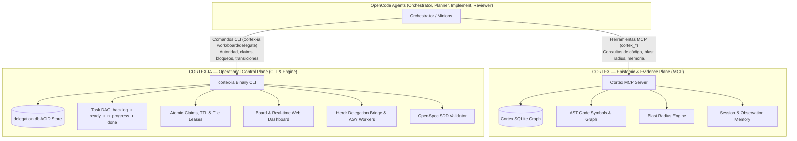

# Guía de Referencia: Cortex (MCP) vs Cortex-IA (Control Plane)

---

## 🧭 1. Resumen de Diferenciación Fundamental



| Dimensión | **CORTEX** (Servidor MCP) | **CORTEX-IA** (Binario CLI / Motor) |
|---|---|---|
| **Naturaleza** | Servidor MCP estandarizado (32 herramientas `cortex_*`) | Binario ejecutable Go (`cortex-ia.exe`) |
| **Rol en el Sistema** | **Plano Epistémico y de Evidencia** | **Plano Operacional y de Control** |
| **Almacenamiento** | Base de datos de conocimiento y grafo AST | Base de datos SQLite transaccional (`~/.cortex-ia/delegation.db`) |
| **Responsabilidades** | • Grafo de conocimiento y dependencias AST.<br>• Análisis de radio de impacto (*blast radius*).<br>• Memoria duradera de sesiones y *gotchas*.<br>• Búsqueda híbrida y contexto semántico. | • Grafo acíclico de tareas (DAG) y estados.<br>• Concesión atómica de *claims* y *file leases*.<br>• Versionado optimista CAS y transiciones.<br>• Paneles Kanban duraderos y Web Dashboard.<br>• Delegación a workers externos (Herdr / AGY).<br>• Validación de especificaciones OpenSpec. |
| **Invariante Crítico** | **No posee autoridad de ejecución.** La evidencia o memoria en Cortex nunca autoriza a un agente a editar código o cambiar estados de tareas. | **Única fuente de verdad autoritativa.** La preparación (*readiness*), bloqueos y aprobaciones provienen exclusivamente de `cortex-ia work`. |

---

## 🛠️ 2. Guía de Uso de CORTEX (MCP)

Las herramientas de Cortex se invocan a través del protocolo MCP para consultar el modelo del repositorio y almacenar aprendizaje duradero:

### Principales Herramientas:
1. **Inspección de Grafo y AST**:
   - `cortex_code_scan`: Escanea el repositorio e indexa símbolos AST.
   - `cortex_get_blast_radius`: Evalúa qué funciones/llamadores se ven afectados antes de cambiar una firma.
   - `cortex_code_symbols`: Consulta definiciones e implementaciones de símbolos en el grafo.
2. **Memoria y Contexto Duradero**:
   - `cortex_save`: Guarda observaciones, gotchas, decisiones arquitectónicas o evidencias de bugs.
   - `cortex_search` / `cortex_search_hybrid`: Recupera contexto y lecciones aprendidas previas.
   - `cortex_get_observation`: Lee observaciones detalladas por clave de tópico o ID.
3. **Ciclo de Sesión**:
   - `cortex_session_start` / `cortex_session_end`: Reservado **exclusivamente al `orchestrator`** para demarcar el ciclo de vida de la iniciativa.

---

## ⚡ 3. Guía de Uso de CORTEX-IA (CLI de Control)

Todos los comandos de `cortex-ia` devuelven JSON estructurado, aceptan sintaxis posicional o por flags, y admiten `--help` en todos los niveles.

### A. Gestión de Tableros (`cortex-ia board`)
- **Crear Tablero**:
  ```bash
  cortex-ia board create <board-id> "<Título>" "[Descripción]"
  ```
- **Listar Tableros**:
  ```bash
  cortex-ia board list
  ```
- **Ver Estado / DAG del Tablero**:
  ```bash
  cortex-ia board status <board-id>
  # Aliases soportados:
  cortex-ia board show <board-id>
  cortex-ia board get <board-id>
  ```
- **Lanzar Web Dashboard**:
  ```bash
  cortex-ia web --open
  # o alternativamente:
  cortex-ia board serve --addr 127.0.0.1:7331
  ```

### B. Gestión de Tareas, Leases y Transiciones (`cortex-ia work`)
- **Crear Tarea en el DAG**:
  ```bash
  cortex-ia work create <task-id> "<Título>" --board <board-id> [--depends <dep-task-id>]...
  ```
- **Consultar Estado de Tarea**:
  ```bash
  cortex-ia work status <task-id>
  # Aliases:
  cortex-ia work show <task-id>
  cortex-ia work get <task-id>
  ```
- **Reclamar Tarea (`ready -> in_progress`)**:
  ```bash
  cortex-ia work claim <task-id> --owner <agent-id> --ttl 15m
  # Retorna: claim_token, revision
  ```
- **Renovar Claim en Memoria**:
  ```bash
  cortex-ia work renew <task-id> --claim-token <token> --ttl 15m
  ```
- **Reservar Lease Exclusivo de Archivo**:
  ```bash
  cortex-ia work lease <task-id> --claim-token <token> --path <relative-file> --ttl 15m
  # Retorna: lease_token
  ```
- **Renovar Lease de Archivo**:
  ```bash
  cortex-ia work lease-renew --path <relative-file> --lease-token <token> --ttl 15m
  ```
- **Liberar Lease**:
  ```bash
  cortex-ia work release --path <relative-file> --lease-token <token>
  ```
- **Transición de Tarea**:
  ```bash
  cortex-ia work transition <task-id> --claim-token <token> --to in_review
  ```
- **Aprobación de Revisor Independiente (`in_review -> done`)**:
  ```bash
  cortex-ia work approve <task-id> --reviewer <reviewer-id> --verdict PASS --evidence "<ref>"
  ```
- **Reintentar Tarea Bloqueada (`blocked -> ready`)**:
  ```bash
  cortex-ia work retry <task-id>
  ```
- **Recuperación Automática de Reclamos Huérfanos**:
  ```bash
  cortex-ia work recover
  ```

### C. Validación OpenSpec SDD (`cortex-ia openspec` / `openspec`)
- **Validar especificaciones en `openspec/changes/`**:
  ```bash
  openspec validate
  # o:
  cortex-ia openspec validate
  ```
- **Listar cambios activos**:
  ```bash
  openspec list
  ```
- **Estado de cambios**:
  ```bash
  openspec status
  ```

### D. Delegación Externa y Multiplexación (`cortex-ia delegate`)
- **Registrar y supervisar un worker externo**:
  ```bash
  cortex-ia delegate create --request-file <path> [--transport direct|herdr]
  ```
- **Verificar estado del worker**:
  ```bash
  cortex-ia delegate status <job-id>
  ```
- **Recuperar recibo y métricas de tokens**:
  ```bash
  cortex-ia delegate result <job-id>
  ```

---

## 🔒 4. Reglas de Integración para Agentes

1. **Separación de Responsabilidades**:
   - `orchestrator`: Crea tableros, define DAG de tareas con `cortex-ia work create`, y gestiona sesiones Cortex. **Nunca reclama tareas ni reserva leases.**
   - `planner`: Escribe especificaciones OpenSpec y descompone el DAG.
   - `implement`: Reclama exactamente una tarea con `cortex-ia work claim`, reserva leases con `cortex-ia work lease`, realiza los cambios verificados y transiciona a `in_review`.
   - `reviewer`: Verifica de forma independiente las pruebas y ejecuta `cortex-ia work approve`.
2. **Tokens Efímeros**:
   - Los `claim_token` y `lease_token` son secretos efímeros que residen exclusivamente en memoria viva durante la sesión de trabajo. **Nunca deben persistirse en archivos, repositorios ni mensajes públicos.**
3. **Desbloqueo Automático**:
   - Al ejecutarse `cortex-ia work approve --verdict PASS`, la tarea se marca como `done` y Cortex-IA desbloquea automáticamente las tareas dependientes en `backlog` pasándolas a `ready`.
