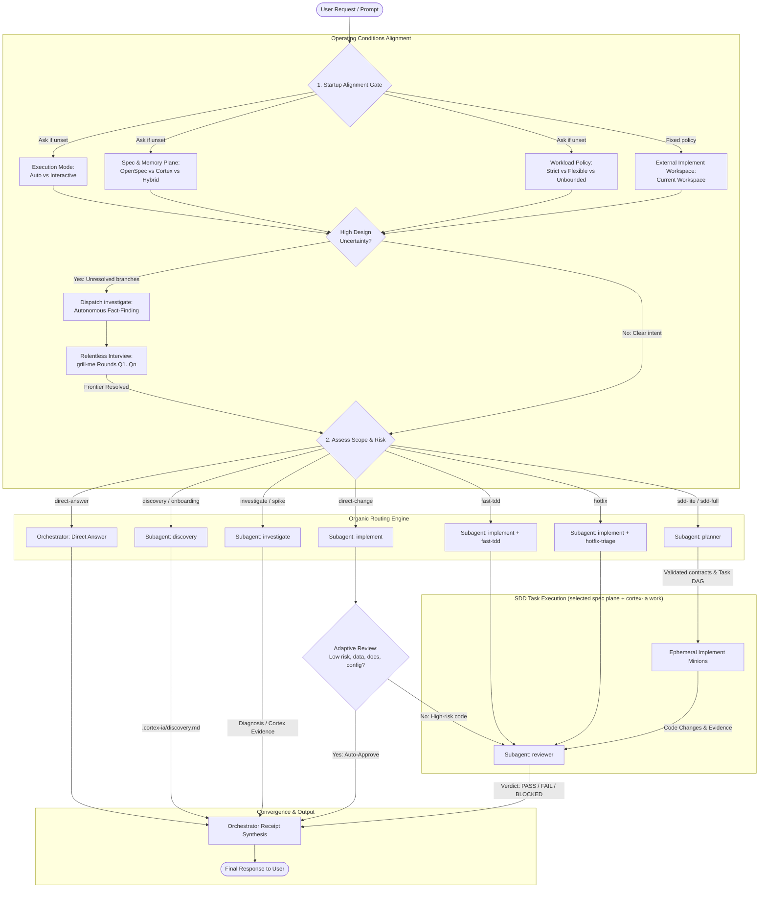
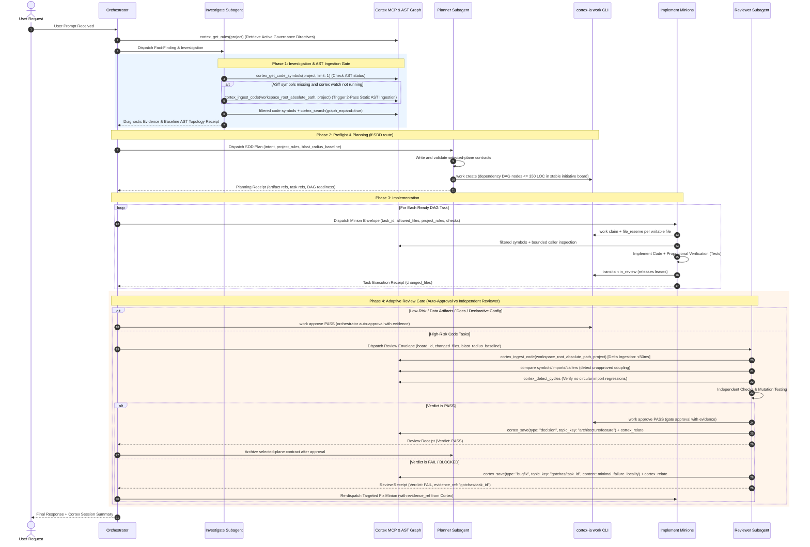
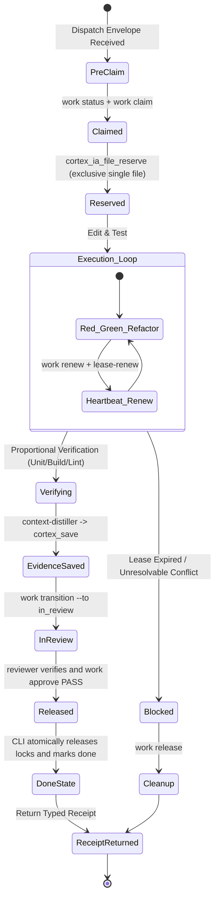
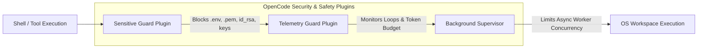

# OpenCode v2 Knowledge Index & Harness Flow Diagrams

Relocated from `internal/assets/AGENTS.md` (the OpenCode v2 knowledge index §I and the §1/§3/§4/§7 mermaid flow diagrams) so the per-session harness injection stays lean. The skill registers `metadata.opencode/autoinvoke: false`: load it explicitly by ID when researching or debugging OpenCode v2 platform capabilities or when a harness flow diagram is needed.

## OpenCode v2 (`opencode2`) Knowledge & Search Index

When researching, developing, or debugging capabilities for **OpenCode v2 (`opencode2`)**, use this canonical index to locate authoritative specifications, official documentation, and local inspection commands.

### 1. Official Documentation Mapping

| Topic & URL | Scope & Key Concepts | When to Consult |
| :--- | :--- | :--- |
| **[Core Docs](https://opencode.ai/v2/docs/)** | Core runtime architecture, Daemon/Server model, File hierarchy (`.config/opencode/` vs `.opencode/`), Precedence & merging rules, `opencode.jsonc` schema, Permissions array format (`[{ action, resource, effect }]`). | When designing configuration templates, setting permissions, or understanding directory precedence. |
| **[CLI & TUI](https://opencode.ai/v2/docs/cli/)** | Global CLI commands, TUI navigation (`opencode2`), `cli.json` configuration, Theme switching (`/themes`), Keybindings, Terminal Truecolor requirement (`COLORTERM=truecolor`). | When configuring user TUI preferences, themes, keybindings, or troubleshooting TUI rendering. |
| **[Build & Plugins](https://opencode.ai/v2/docs/build/)** | Plugin architecture (`@opencode/plugin`), Tool hooks (`ctx.tool.hook`), Transforms (`ctx.tool.transform`), Event subscriptions (`ctx.event`), Context extensions (`ctx.agent`, `ctx.provider`, `ctx.model`, `ctx.mcp`, `ctx.command`), Custom tools. | When authoring plugins, guards, telemetry interceptors, or runtime middleware. |
| **[API & Server](https://opencode.ai/v2/docs/api/)** | OpenAPI 3.1.0 specification, Background service daemon, HTTP `/api/*` endpoints, WebSocket event streaming, Session compaction, Snapshot management. | When interacting directly with the local OpenCode daemon via HTTP or building client bridges. |

### 2. Live CLI Inspection Helpers (`opencode2`)

Use the native binary (`opencode2`) directly to inspect live runtime state:

- `opencode2 debug paths`: Print active filesystem locations (`home`, `data`, `cache`, `config`, `state`, `log`, `db`).
- `opencode2 debug config`: Print all resolved configuration sources and the fully merged active configuration tree.
- `opencode2 models`: List all active AI models and provider connectivity.
- `opencode2 --print-logs`: Stream real-time diagnostic server logs to stderr.
- `opencode2 stats`: Output shareable usage statistics.

### 3. Project Skills & Developer Helpers

Project-level skills are located in `.agents/skills/` (ready for use in this repository without asset embedding):

- **`opencode-theme-dev`** (`.agents/skills/opencode-theme-dev/SKILL.md`):
  - Author and migrate v2 themes (`base`, `dark`, `light`, 9-step `hue` scales, `categorical`).
  - Validation helper: `node scripts/validate-theme.mjs <theme.json>` (checks all 16 required tokens).
  - Reference: `.agents/skills/opencode-theme-dev/references/theme-token-spec.md`.
- **`opencode-plugin-dev`** (`.agents/skills/opencode-plugin-dev/SKILL.md`):
  - Develop native plugins using `@opencode/plugin` and the universal dual-mode wrapper (`Plugin.define`).
  - Reference: `.agents/skills/opencode-plugin-dev/references/plugin-api-reference.md`.
  - Examples: `.agents/skills/opencode-plugin-dev/examples/tool-guard-plugin.ts`.
- **`opencode-installer-dev`** (`.agents/skills/opencode-installer-dev/SKILL.md`):
  - Best practices for configuration installers and environment orchestrators targeting `opencode2`.
  - Reference: `.agents/skills/opencode-installer-dev/references/opencode-v2-precedence.md`.

## Harness Flow Diagrams

### 1. Session Startup Alignment & Subagent Topology (startup flowchart)

### 3. SDD Lifecycle & Preflight (sequence diagram)

### 4. Implementation Minion Lifecycle (state diagram)

### 7. Safety, Shell Boundaries & Guard Plugins (guard flow)

