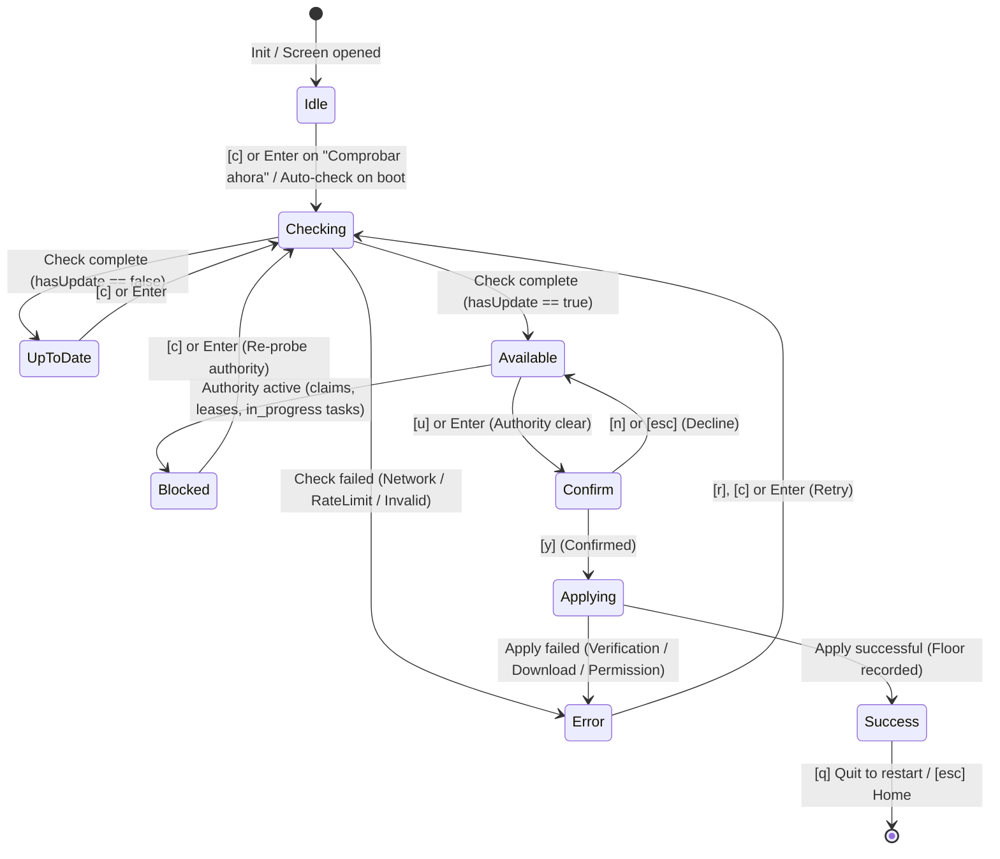

# Design — TUI Menu Reordering and Interactive Software Upgrade Screen

## Component Boundaries & Seam Placement

All implementation changes reside within package `internal/tui/`, interfacing with `internal/updater/` and `internal/delegation/`.

### 1. File Responsibilities

| File | Responsibility | LOC Budget |
|---|---|---|
| `internal/tui/model.go` | Screen enum (`screenUpgrade`), menu indices constants, hotkey dispatch (`u`/`U`, digits 1-9), message delegation | Modify existing (~805 LOC) |
| `internal/tui/views.go` | `homeEntries` (11), `homeDescriptions` (11), conditional update badge rendering in `viewHome()`, wire-up in `View()` | Modify existing (~573 LOC) |
| `internal/tui/actions.go` | `openUpgrade()` transition and initial check command dispatch | Modify existing (~526 LOC) |
| `internal/tui/upgrade_screen.go` | **New file**: `upgradeState`, FSM phases, actions, typed messages, seams, `update()` and `view()` | <= 350 LOC |
| `internal/tui/upgrade_screen_test.go` | **New file**: modular FSM state transition and seam unit tests | <= 250 LOC |
| `internal/tui/navigation_test.go` | Updated menu walking, hotkeys, and bounds assertions | <= 380 LOC |
| `internal/tui/providers_home_test.go` | Updated custom providers index (entry 3) assertions | <= 250 LOC |

### 2. Menu Reordering & Index Mapping

The Home menu entries are rearranged into four logical tiers:

```
[Gestión / Configuración]
  [1] Install / Sync                    (index 0)
  [2] Manage MCPs                       (index 1)
  [3] Configuración de modelos          (index 2, hotkey 'm')
  [4] Install custom provider           (index 3, hotkey 'p')
[Herramientas / Dashboards]
  [5] CortexIA Web Console              (index 4)
  [6] Estadísticas de uso               (index 5)
  [7] Agent Studio (Create Sub-agent)   (index 6)
[Mantenimiento]
  [8] Doctor / Recovery                 (index 7)
  [9] Actualizar software (Upgrade)     (index 8, hotkey 'u')
[Ciclo de vida]
  [10] Uninstall                        (index 9)
  [11] Quit                             (index 10, hotkey 'q')
```

Index constants in `internal/tui/model.go`:
```go
const (
	modelsEntryIndex    = 2
	providersEntryIndex = 3
	webEntryIndex       = 4
	statsEntryIndex     = 5
	studioEntryIndex    = 6
	doctorEntryIndex    = 7
	upgradeEntryIndex   = 8
	uninstallEntryIndex = 9
	quitEntryIndex      = 10
)
```

Home keyboard handling:
- Digits `1`–`9` map directly to `selectHomeEntry(0)` through `selectHomeEntry(8)`.
- Dedicated hotkeys:
  - `m`, `M`: `openModels()` (index 2)
  - `p`, `P`: `openProviders()` (index 3)
  - `u`, `U`: `openUpgrade()` (index 8)
  - `q`: `tea.Quit`
- Cursor navigation (`up`/`down`, `k`/`j`) spans indices `0` through `10`.
- `enter` executes `selectHomeEntry(m.cursor)`.

---

## Upgrade Screen FSM Design

### Finite State Machine (upgradePhase)



### Type Definitions

```go
type upgradePhase int

const (
	upgradePhaseIdle upgradePhase = iota
	upgradePhaseChecking
	upgradePhaseUpToDate
	upgradePhaseAvailable
	upgradePhaseConfirm
	upgradePhaseApplying
	upgradePhaseSuccess
	upgradePhaseBlocked
	upgradePhaseError
)

type upgradeAction int

const (
	upgradeActionNone upgradeAction = iota
	upgradeActionHome
	upgradeActionQuit
)

type upgradeState struct {
	homeDir        string
	currentVersion string
	latestVersion  string
	releaseDate    time.Time
	releaseNotes   string
	phase          upgradePhase
	errText        string
	hasAuthority   bool
	authorityErr   string
	appliedTag     string
}
```

### Bubble Tea Messages and Commands

```go
type upgradeCheckMsg struct {
	release      *updater.Release
	hasUpdate    bool
	hasAuthority bool
	err          error
}

type upgradeApplyMsg struct {
	appliedTag string
	err        error
}

func upgradeCheckCmd(version, homeDir string) tea.Cmd
func upgradeApplyCmd(version, floor, homeDir string) tea.Cmd
```

---

## Testable Seams Architecture

To prevent unit tests from triggering network calls to GitHub or touching `delegation.db`, package-level function seams are established in `internal/tui/upgrade_screen.go`:

```go
var (
	upgradeCheckSeam = func(ctx context.Context, version, home string) (*updater.Release, bool, bool, error) {
		client := updater.New("")
		client.StateHome = filepath.Join(home, ".cortex-ia")
		rel, hasUpdate, err := client.CheckLatest(ctx, version)
		if err != nil {
			return nil, false, false, err
		}
		dbPath := delegation.DefaultDBPath(home)
		hasAuth, authErr := probeActiveAuthority(ctx, dbPath)
		if authErr != nil {
			return rel, hasUpdate, false, authErr
		}
		return rel, hasUpdate, hasAuth, nil
	}

	upgradeApplySeam = func(ctx context.Context, version, floor, home string) (string, error) {
		return applyUpdateToCurrentBinary(ctx, version, floor)
	}
)
```

In `upgrade_screen_test.go`, tests replace `upgradeCheckSeam` and `upgradeApplySeam` in `t.Cleanup` blocks, isolating state completely using `t.TempDir()`.

---

## Layout and Views

### Wireframe: screenUpgrade (Update Available)

```
┌ cortex-ia v0.4.57 · Actualizar software · /Users/luisl ──────────┐
│                                                                  │
│  Actualización de Software                                       │
│                                                                  │
│  Versión actual instalada:   v0.4.57                             │
│  Versión más reciente:       v0.5.0 (Publicada: 2026-10-01)      │
│  Estado de verificación:     SHA-256 (checksums.txt)             │
│  Autoridad de trabajo:       Despejada (sin tareas activas)      │
│                                                                  │
│  Notas de release (v0.5.0):                                      │
│  ┌────────────────────────────────────────────────────────────┐  │
│  │ • Reordenación del menú principal por grupos funcionales   │  │
│  │ • Nueva pantalla interactiva de actualización en TUI       │  │
│  │ • Verificación estricta de autoridad de trabajo preflight   │  │
│  └────────────────────────────────────────────────────────────┘  │
│                                                                  │
│  [u] Actualizar a v0.5.0 · [c] Comprobar ahora · [esc] Volver   │
└──────────────────────────────────────────────────────────────────┘
```

### Wireframe: screenUpgrade (Blocked by Authority)

```
┌ cortex-ia v0.4.57 · Actualizar software · /Users/luisl ──────────┐
│                                                                  │
│  Actualización de Software                                       │
│                                                                  │
│  Versión actual instalada:   v0.4.57                             │
│  Versión más reciente:       v0.5.0 (Publicada: 2026-10-01)      │
│                                                                  │
│  ⚠ ACTUALIZACIÓN BLOQUEADA POR AUTORIDAD ACTIVA                  │
│  Hay tareas in_progress, leases de archivos o claims activos      │
│  en delegation.db.                                               │
│                                                                  │
│  Completa, libera o reconcilia las tareas activas antes de       │
│  actualizar el binario de cortex-ia.                             │
│                                                                  │
│  [c] Reintentar comprobación · [esc] Volver al menú principal   │
└──────────────────────────────────────────────────────────────────┘
```

### Home Menu Update Badge

In `internal/tui/views.go`:
```go
if i == upgradeEntryIndex && cachedUpdateAvailable {
    badge := " " + styleWarn.Render("[NEW "+cachedTag+"]")
    // rendered beside entry title
}
```

---

## Design Trade-offs & Alternatives

1. **Inline Modal vs Dedicated Sub-screen**:
   - *Option A*: Modal overlay on Home menu. Rejected because release notes and authority diagnostics require multi-line space and scrollability.
   - *Option B (Chosen)*: Dedicated sub-screen (`screenUpgrade`) modeled after `providers_screen.go`. Encapsulates FSM, retains clean back-navigation (`esc`/`b`), and scales cleanly.
2. **Synchronous vs Asynchronous Checking**:
   - *Option A*: Run check during TUI boot or on screen enter synchronously. Rejected because slow networks or rate limits would freeze the UI.
   - *Option B (Chosen)*: Asynchronous `tea.Cmd` (`upgradeCheckCmd`) with spinner/progress phase `upgradePhaseChecking`.
3. **Seam Placement**:
   - *Option A*: Exported methods on `ServiceAPI`. Rejected because updater is independent of `install.Service`.
   - *Option B (Chosen)*: Package-level function seams matching `providers_screen.go` and `models_screen.go`. Ensures zero impact on `install.Service` API contract while enabling hermetic unit tests.
